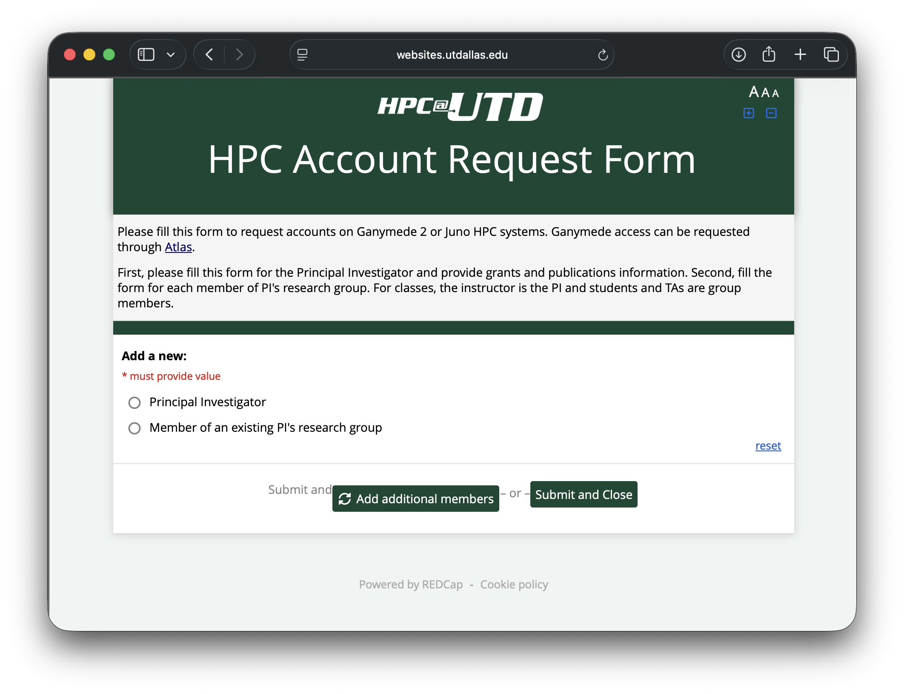

# How to Request an Account

## Overview

To use Juno, you need a valid UT Dallas NetID with appropriate access permissions. This page explains the account request process.

## Eligibility

Juno accounts are available to:

- UT Dallas faculty members
- UT Dallas researchers
- Graduate students (with faculty sponsor)
- Undergraduate students (with faculty sponsor for research purposes)
- Collaborators (with faculty sponsor)

## Account Request Process

### Step 1: Determine Your Access Type

**Faculty**: Direct access eligibility

**Staff, Graduate, and Undergraduate Students**: Requires faculty sponsor approval

**External Collaborators**: Requires faculty sponsor and approval

Please contact us if you don't fall under any of these categories.

### Step 2: Submit Request

[Submit an account request](https://websites.utdallas.edu/research/hpc-account/)

**Required Information**:

- Full name, email address, and NetID of the principal investigator (PI)
- Full name and NetID of the user
- Department/College affiliation
- Funding information (if applicable)

### Step 3: Account Approval

Once submitted, your request will be reviewed by:

1. Your faculty sponsor (if applicable)
2. HPC team

**Processing Time**: Up to 5 business days for standard requests

### Step 4: Receive Credentials

After approval, you will receive:

- A welcome email
- An email with your credentials and instructions for initail login
- An invite to a virtual Juno orientation session
- Onboarding assistance (for new PI/research groups)
- Information about available resources

## Initial Setup

### First Login

Upon receiving your credentials, follow the [login instructions](login.md).

### Orientation

Attending (or watching a recording of) the Juno Orientation is strongly recommended for all new users.

- Juno orientation is scheduled every week on Wednesday at noon
- As a new user, you will be invited to the next available Juno orientation session right after your account is created. If you wish to attend a later session, [please let us know](mailto:circ-assist@utdallas.edu)
- [Access recorded orientations on the documentation site](https://hpc.utdallas.edu/systems-resources/juno/)

## Account Policies

### Acceptable Use

Users must:

- Use resources for approved research/academic purposes only
- Follow UT Dallas IT policies
- Respect fair-share scheduling
- Report security concerns immediately
- Not share credentials with others

### Account Maintenance

- Accounts remain active as long as you're affiliated with UT Dallas
- Graduate student accounts may require annual faculty sponsor renewal

### Data Retention

Upon account deactivation, contact [circ-assist@utdallas.edu](mailto:circ-assist@utdallas.edu) to arrange data retrieval before access is removed.

**As a PI**: If you wish to retain data from a former group member, contact support promptly after their departure.

**As a graduating student**: Back up data from your `home`, `work`, and `/groups` directories before your account is deactivated. Scratch space is never backed up and is subject to the purge policy regardless of account status.

## Troubleshooting

### Request Not Approved?

**Common reasons**:

- Missing faculty sponsor approval
- Incomplete request form
- Lack of NetID or university affiliation
- Students applying as a PI 

**Solution**: Contact [circ-assist@utdallas.edu](mailto:circ-assist@utdallas.edu) for clarification

### Account Locked?

Contact support immediately if you believe your account has been locked due to:

- Failed login attempts
- Security concerns
- Policy violations

## Next Steps

After your account is approved:

1. [Learn how to log in →](login.md)
2. [Understand storage options →](storage.md)
3. [Start with basic Linux commands →](../working-on-juno/linux-commands.md)

## Need Help?

- **Email**: [circ-assist@utdallas.edu](mailto:circ-assist@utdallas.edu)
- **HPC Services**: [hpc.utdallas.edu/services](https://hpc.utdallas.edu/services)
- **Open a ticket**: Visit the [services page](https://hpc.utdallas.edu/services/) to submit a detailed request
