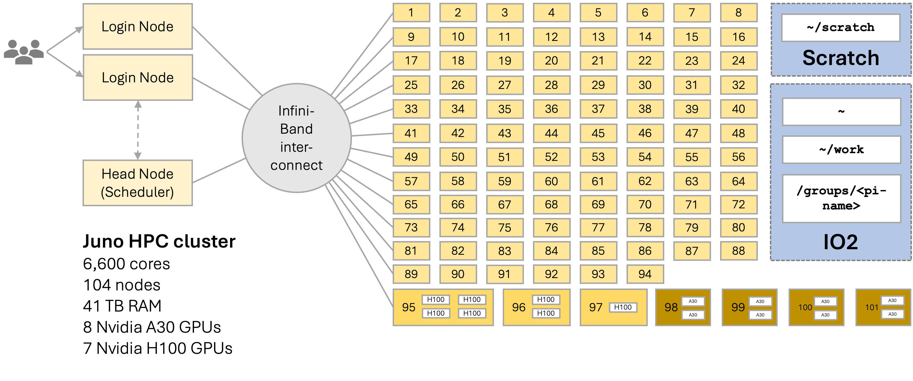
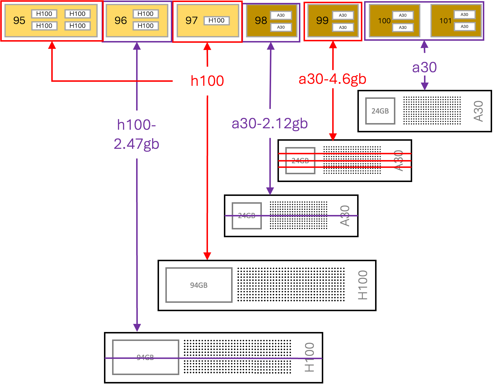

# Hardware Overview

## Cluster Diagram

## Node Types

Juno consists of **101 compute nodes** organized into four categories, plus login and head nodes. An additional **26 NVIDIA H200 GPU nodes are arriving soon** (see [below](#gpu-compute-nodes-nvidia-h200-coming-soon)).

## Login and Head Nodes

| Quantity | CPU | Cores/node | RAM | Storage | Network |
|----------|-----|------------|-----|---------|---------|
| 3 | 2× Intel Xeon Silver 4309Y 2.8 GHz | 8C/16T | 128–384 GB | 3.84 TB SSD (2× 1.92 TB) | HDR100 InfiniBand, 2× 1 Gbps Ethernet |

These nodes handle login sessions, job submission, and cluster management. **Do not run computational work on login nodes.**

## CPU Compute Nodes

| Quantity | CPU | Cores/node | RAM | Storage | Network |
|----------|-----|------------|-----|---------|---------|
| 94 | 2× AMD EPYC 9334 2.7 GHz | 32C/64T per CPU → **64 cores total** | 384 GB | 480 GB SSD | HDR100 InfiniBand, 10/25 Gbps Ethernet |

These are the standard compute nodes used for most CPU-based workloads. Submit jobs to the `normal` or `dev` partitions.

## GPU Compute Nodes — NVIDIA H100

| Quantity | CPU | Cores/node | RAM | GPUs | GPU Memory | Network |
|----------|-----|------------|-----|------|------------|---------|
| 1 | 2× Intel Xeon Platinum 8462Y 2.8 GHz | 32C/64T per CPU → **64 cores total** | 512 GB | 4× H100 (physical, 80 GB HBM3 each) | 80 GB | HDR100 InfiniBand, 2× 10/25 Gbps Ethernet |
| 1 | 2× Intel Xeon Platinum 8462Y 2.8 GHz | 64 cores total | 512 GB | 2× H100 (physical, 94 GB NVL) | 94 GB | HDR100 InfiniBand |
| 1 | 2× Intel Xeon Platinum 8462Y 2.8 GHz | 64 cores total | 512 GB | 1× H100 (physical, 94 GB NVL) | 94 GB | HDR100 InfiniBand |

H100 nodes also support **virtual GPU slicing** — a single physical H100 can be split into multiple virtual GPUs. See the [SLURM partitions table](../running-programs/slurm.md#partitions-overview) for available GPU configurations.

!!! note "NVLink is only on `g-04-02`"
    Only the **4× H100 (80 GB HBM3)** node, `g-04-02`, has **NVLink** for fast direct GPU-to-GPU communication. Despite the "NVL" in their product name, the 94 GB H100 NVL nodes do **not** have NVLink bridges installed, and the A30 nodes have no NVLink either — on all other nodes, GPUs communicate over PCIe. This matters for multi-GPU jobs (see [PyTorch Training Tutorial](../ai-and-ml/pytorch-training.md)).

## GPU Compute Nodes — NVIDIA A30

| Quantity | CPU | Cores/node | RAM | GPUs | GPU Memory | Network |
|----------|-----|------------|-----|------|------------|---------|
| 4 | 2× AMD EPYC 9534 2.45 GHz | 64C/128T per CPU → **128 cores total** | 1,024 GB | 2× A30 (physical, 24 GB each) | 24 GB | HDR100 InfiniBand, 2× 10/25 Gbps Ethernet |

A30 nodes also support virtual GPU slicing into 12 GB and 6 GB configurations.

## GPU Compute Nodes — NVIDIA H200 (Coming Soon)

!!! warning "Not yet available — expected June 2026"
    The H200 nodes are being added to Juno and are **not yet online**. The `h200` partition does not exist until the rollout completes. Specs marked TBD will be finalized before launch. See [GPU Computing on Juno](../ai-and-ml/index.md).

| Quantity | CPU | Cores/node | RAM | GPUs | GPU Memory | Network |
|----------|-----|------------|-----|------|------------|---------|
| 26 | TBD | TBD | TBD | 2× H200 NVL (141 GB each) | 141 GB | 400 Gb InfiniBand (NDR), PCIe Gen 5.0 |

H200 NVL cards have **no NVLink** — GPUs communicate over PCIe Gen 5.0 within a node and over 400 Gb InfiniBand between nodes.

## Available GPU Configurations

| Partition | GPU Type | Count | VRAM Each |
|-----------|----------|-------|-----------|
| `a30` | A30 physical | 2 per node | 24 GB |
| `a30-2.12gb` | A30 virtual (half) | 4 per node | 12 GB |
| `a30-4.6gb` | A30 virtual (quarter) | 8 per node | 6 GB |
| `h100` | H100 physical | 4 per node | 80 GB |
| `h100-94gb` | H100 physical (NVL) | 1 per node | 94 GB |
| `h100-2.47gb` | H100 virtual (half) | 4 per node | 47 GB |
| `h200` *(coming soon)* | H200 NVL | 2 per node | 141 GB |

## Network Infrastructure

All current compute nodes are connected via **HDR100 InfiniBand (100 Gb/s)** for low-latency, high-bandwidth MPI communication, and use **PCIe Gen 4.0** for device (GPU and network card) attachment.

The forthcoming H200 nodes use faster interconnects: **400 Gb InfiniBand (NDR)** between nodes and **PCIe Gen 5.0** for device attachment.

## Storage Systems

See [Storage and Data Transfer](storage.md) and [Scratch Space](scratch-space.md) for details on available storage systems.

| System | Path | Quota | Backup | Use For |
|--------|------|-------|--------|---------|
| Home (Io) | `~` | 50 GB | Daily | Config files, scripts, small data |
| Work (Io) | `~/work` | 1 TB | Daily | Large software, data, results |
| Group (Io) | `/groups/<pi-name>` | 1 TB+ | Daily | Shared group data |
| Scratch | `~/scratch` | 30 TB | Never | High-speed I/O during batch jobs |

Scratch is up to **10× faster** for large I/O than home, work, or group directories.

## Next Steps

- [See available partitions and job limits →](../running-programs/slurm.md)
- [Storage and data management →](storage.md)
- [Request an account →](account-request.md)
