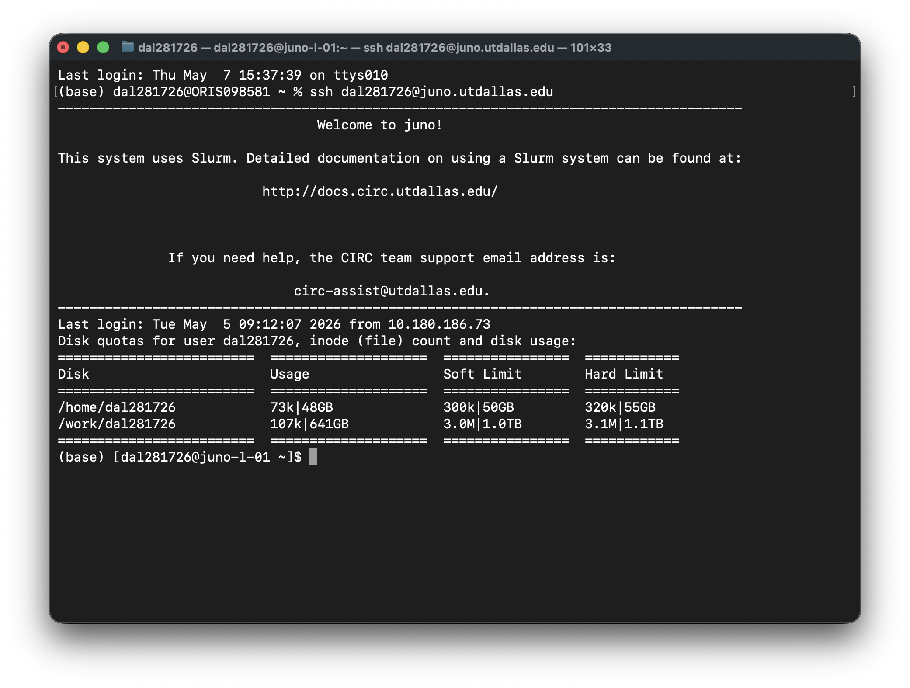

# How to Log In to the System

## Overview

This guide covers the different methods to access Juno HPC cluster.

```
  Your laptop / workstation                            Juno HPC Cluster
  ┌──────────────────────┐              ┌──────────────────────────────────────────┐
  │                      │     SSH      │  ┌──────────────────────────────────────┐│
  │  $ ssh netID@juno…   │─────────────►│  │ Login Node (juno-l-01 and juno-l-02) ││
  │                      │              │  └────────────────┬─────────────────────┘│
  │  Browser:            │    HTTPS     │                   │  sbatch / srun       │
  │  juno-ood.hpc…       │─────────────►│                   ▼                      │
  │                      │              │  ┌──────────────────────────────────────┐│
  └──────────────────────┘              │  │          Compute Nodes               ││
                                        │  │   normal │ h100 │ a30 │ dev │ vdi    ││
                                        │  └──────────────────────────────────────┘│
                                        └──────────────────────────────────────────┘
```

## SSH Login (Command Line)

### Basic Login

The primary method to access Juno is through SSH (Secure Shell).

**Linux/Mac**

Open your terminal and run:
```bash
ssh netID@juno.utdallas.edu
```
    
Replace `netID` with your netID.

**Windows (PowerShell)**

Open PowerShell and run:
    
```bash
ssh netID@juno.utdallas.edu
```

**Windows (PuTTY)**

1. Download and install [PuTTY](https://www.putty.org/)
2. Open PuTTY
3. Enter hostname: `juno.utdallas.edu`
4. Port: `22`
5. Connection type: SSH
6. Click "Open"
7. Enter your username and password when prompted

### First-Time Login

When logging in for the first time:

1. You'll see a message about host authenticity:
   ```
   The authenticity of host 'juno.utdallas.edu' can't be established.
   Are you sure you want to continue connecting (yes/no)?
   ```

2. Type `yes` and press Enter

3. Enter your password when prompted (characters won't appear as you type)

4. You should see the Juno welcome message and command prompt

**Login Node**

After successful login, you'll be on a **login node**. The prompt will show something like:
```
[netID@juno-l-01 ~]$
```



## SSH Key Authentication (Recommended)

SSH keys let you log in without a password and are required by many tools (VS Code Remote, file sync scripts, Jupyter tunnels). For the full setup guide — including key generation, copying your key to Juno, SSH config aliases, and troubleshooting — see:

**[SSH Key Authentication →](ssh-keys.md)**

## Login with X11 Forwarding (for GUI)

To run graphical programs over SSH, add `-X` to your login command:

```bash
ssh -X netID@juno.utdallas.edu
```

This requires an X server on your local machine (XQuartz on Mac, MobaXterm on Windows; pre-installed on Linux). For the full setup, testing, and troubleshooting, see [Launching GUI Programs](../gui-and-tools/gui-programs.md). For most interactive GUI work, **Open OnDemand (below) is easier**.

## Open OnDemand (Web Interface)

Access Juno through your web browser:

### Accessing Open OnDemand

1. Navigate to: [https://juno-ood.hpcre.utdallas.edu/](https://juno-ood.hpcre.utdallas.edu/)
2. Log in with your Juno credentials
3. You'll see the Open OnDemand dashboard

### Features Available

- **Files**: Browse and manage your files
- **Shell Access**: Web-based terminal
- **Interactive Apps**: Launch Jupyter, RStudio, MATLAB, etc.
- **Job Composer**: Create and submit jobs through GUI
- **Active Jobs**: Monitor your running jobs

!!! tip
    Open OnDemand is perfect for users who prefer graphical interfaces or need to access Juno from networks that block SSH.

For detailed Open OnDemand usage, see [Launching GUI Programs](../gui-and-tools/gui-programs.md).

## Connection Issues

### Cannot Connect

**Check your network**:
```bash
ping juno.utdallas.edu
```

**Common issues**:

- **Off-campus**: You may need to use [VPN](https://atlas.utdallas.edu/TDClient/30/Portal/Requests/ServiceDet?ID=167)
- **Firewall**: SSH port 22 might be blocked
- **Incorrect hostname**: Verify `juno.utdallas.edu`

### Connection Timeout

If connection times out:

1. Verify you're on UT Dallas network or VPN
2. Check if SSH port 22 is accessible:
   ```bash
   telnet juno.utdallas.edu 22
   ```
3. Contact [circ-assist@utdallas.edu](mailto:circ-assist@utdallas.edu)

### Authentication Failed

**Wrong password**:

- Verify credentials. If you change your NetID password, use the new password
- Check Caps Lock
- Reset password if needed

**SSH key not working**:
```bash
# Check key permissions
chmod 700 ~/.ssh
chmod 600 ~/.ssh/id_ed25519
chmod 644 ~/.ssh/id_ed25519.pub
```

### Connection Dropped

If your connection frequently drops:

**Use `tmux` or `screen`**:
```bash
# Start tmux session
tmux new -s mysession

# Your work continues even if disconnected
# Reconnect with:
tmux attach -t mysession
```

## Login Node Best Practices

**Important:**
    Login nodes are shared resources. **Do not run computational work on login nodes.**

**Acceptable on login nodes**:

- Editing files
- Compiling code
- Transferring small files
- Submitting jobs
- Light testing

**Not acceptable on login nodes**:

- Running simulations
- Processing large datasets
- Memory-intensive operations
- Long-running computations

For computational work, use [compute nodes via SLURM](../running-programs/slurm.md).

## Quick Reference

### Login Commands

| Purpose | Command |
|---------|---------|
| Basic login | `ssh netID@juno.utdallas.edu` |
| Login with X11 | `ssh -X netID@juno.utdallas.edu` |
| Specify SSH key | `ssh -i ~/.ssh/mykey netID@juno.utdallas.edu` |
| Keep connection alive | `ssh -o ServerAliveInterval=60 netID@juno.utdallas.edu` |

### Useful After Login

```bash
# Check your quota
mfsgetquota -H ~

# See who else is logged in
who

# Check system load
uptime

# View your jobs
squeue --me
```

## Next Steps

After successfully logging in:

1. [Explore storage options →](storage.md)
2. [Learn basic Linux commands →](../working-on-juno/linux-commands.md)
3. [Submit your first job →](../running-programs/slurm.md)

## Need Help?

- **Email**: [circ-assist@utdallas.edu](mailto:circ-assist@utdallas.edu)
- **HPC Services**: [hpc.utdallas.edu/services](https://hpc.utdallas.edu/services)
