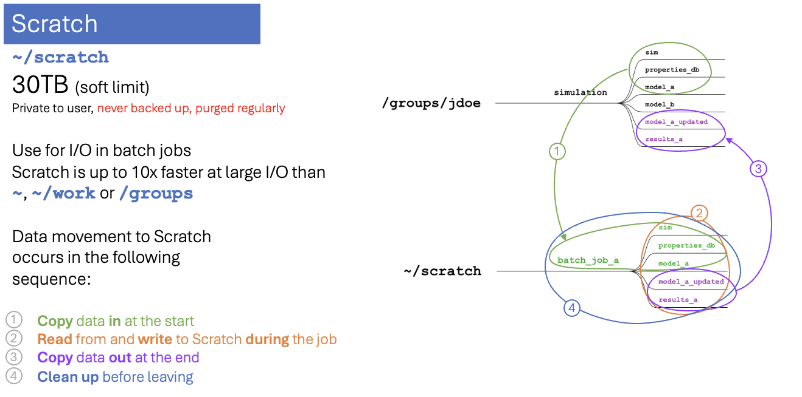

# Scratch Space

## Overview

Scratch is Juno's high-performance temporary filesystem, designed for fast I/O during job execution. It is up to **10× faster** than the Io storage system (`~`, `~/work`, `/groups`) for large I/O, but it is **never backed up** and is subject to an automatic purge policy.

!!! danger "Scratch is never backed up"

    There are **no backups, snapshots, or recovery** of any kind for scratch. Anything that is deleted, purged, lost to a hardware failure, or overwritten is **gone permanently** — Juno staff cannot get it back. Treat scratch as disposable working space only: keep the authoritative copy of anything you care about in `~/work`, `/groups`, or your own external storage, and copy results off scratch as soon as a job finishes.

| Property | Value |
|---|---|
| Path | `~/scratch` |
| Quota | 30 TB (soft limit) |
| Performance | Up to 10× faster than Io for large I/O |
| Backup | **None** |
| Shared with Ganymede 2 | **Yes** — same filesystem, same quota |
| Purge | Files not accessed in **45 days** will be purged |

!!! info "`~/scratch` is the same filesystem on Juno and Ganymede 2"
    Scratch is shared between the two clusters: a file written from a Juno job is immediately visible to a Ganymede 2 (G2) job at the same path, and the 30 TB quota is shared across both. You never need to copy scratch data between clusters — and cleaning up on one cluster frees space on the other. The same is true of `/groups/<pi-name>`.

    This also means the **45-day purge applies to the single shared copy**: a file you last touched from G2 is at risk on Juno too, and vice versa.

For an overview of all storage tiers and how to move data between them, see [Storage and Data Transfer](storage.md).

!!! warning "Soft limit vs. hard limit"

    The 30 TB quota is a **soft limit**. When you cross it, the file system gives you a 7-day grace period to clean up and free space so you can keep writing. After 7 days, if nothing changes, you hit the **hard limit**: you will no longer be able to write any new files, and any additional files you try to transfer in will be **corrupted**.

    Check your scratch usage with `du -sh ~/scratch` and stay well under the limit — and remember that scratch is **never backed up**, so freeing space by deleting files is permanent.

## When to Use Scratch

**Good uses:**

- Large input/output files during active computation
- Intermediate and temporary files generated during a job
- High-I/O workloads: many reads/writes, parallel I/O from multiple nodes
- Per-job working directories

**Do not use scratch for:**

- Long-term storage or anything you can't regenerate (it is never backed up)
- Results for publication or reference datasets — move these to `~/work` or `/groups`
- Source code, scripts, and config files — keep these in `~` (see [Storage](storage.md))

## Purge Policy

Files **not accessed in 45 days** will be automatically purged. There is **no recovery** after a purge.

The purge is based on **access time** (the last time a file was read or written):

```bash
# Check a file's access time
stat ~/scratch/myfile.txt

# Find files not accessed in 30+ days (at risk)
find ~/scratch -type f -atime +30

# Total size of at-risk files
find ~/scratch -type f -atime +30 -exec du -ch {} + | tail -1
```

Reading, writing, or running a program against a file resets its access time. Merely listing a directory or checking file properties does **not**.

### Avoiding a purge

The right way to keep important data is to move it off scratch:

```bash
# Move results to permanent, backed-up storage
mv ~/scratch/results/*.txt ~/work/project/results/
```

Touching files to reset their access time (`find ~/scratch/project -type f -exec touch {} \;`) only delays the inevitable — use it sparingly, not as a substitute for moving data you intend to keep.

## Recommended Workflow



1. **Stage** input data into scratch before the job (see [data transfer](storage.md#data-transfer-methods))
2. **Process** on scratch during the job for fast I/O
3. **Save** important results to `~/work` or `/groups` (backed up)
4. **Clean up** scratch when the job finishes

### Use a per-job directory

Giving each job its own scratch directory keeps runs isolated and makes cleanup trivial:

```bash
#!/bin/bash
#SBATCH -J simulation
#SBATCH -o output_%j.log

JOB_DIR=~/scratch/job_$SLURM_JOB_ID
mkdir -p $JOB_DIR
cd $JOB_DIR

./simulation > output.log

# Save what you need, then clean up
cp output.log ~/work/results/simulation_$SLURM_JOB_ID.log
rm -rf $JOB_DIR
```

### Array jobs

Each array task gets its own directory via `$SLURM_ARRAY_TASK_ID`:

```bash
#!/bin/bash
#SBATCH -J array_job
#SBATCH --array=1-100

TASK_DIR=~/scratch/task_$SLURM_ARRAY_TASK_ID
mkdir -p $TASK_DIR && cd $TASK_DIR

python ~/project/process.py --task $SLURM_ARRAY_TASK_ID
cp output.txt ~/work/results/output_$SLURM_ARRAY_TASK_ID.txt
rm -rf $TASK_DIR
```

### Node-local scratch (`$TMPDIR`)

For the very fastest temporary I/O — especially many small files — use the node-local `$TMPDIR`, then copy results back to `~/scratch` before the job ends (node-local storage is wiped when the job finishes):

```bash
TEMP_DIR=$TMPDIR/workdir
mkdir -p $TEMP_DIR

cp ~/scratch/input/* $TEMP_DIR/      # stage in
cd $TEMP_DIR && python fast_process.py
cp output/* ~/scratch/results/       # copy back before job ends
```

## Monitoring Usage

```bash
# Total scratch usage
du -sh ~/scratch

# Usage by project
du -h --max-depth=1 ~/scratch | sort -h

# Largest files
find ~/scratch -type f -exec du -h {} + | sort -hr | head -20
```

## Troubleshooting

### Files disappeared

If files were purged, they are **not recoverable** — restore from your own external backups or regenerate the data. Prevent recurrence by moving anything important to `~/work` or `/groups` promptly.

### Out of scratch space

```bash
du -sh ~/scratch                       # check usage
find ~/scratch -mtime +30 -delete      # remove old files
```

For compressing or archiving files before removing them, see the [compression commands](../working-on-juno/linux-commands.md#compression-and-archives). If you need more space for active work, request an increase via a support ticket.

### Slow I/O on scratch

Scratch performs best with fewer, larger files. If I/O is slow:

- Combine many small files into larger archives
- Use node-local `$TMPDIR` for temporary scratch I/O
- Avoid having all tasks write to the same file simultaneously

## Quick Reference

```bash
cd ~/scratch                                   # navigate
du -sh ~/scratch                               # check usage
find ~/scratch -type f -atime +30              # find files at risk of purge
mv ~/scratch/results ~/work/                   # move results to backed-up storage
rm -rf ~/scratch/old_project                   # clean up
```

## Next Steps

- [Storage and data transfer →](storage.md)
- [Submit jobs that use scratch space →](../running-programs/slurm.md)
- [Optimize I/O performance →](../advanced/python-optimization.md)

## Need Help?

- **Scratch space questions**: [circ-assist@utdallas.edu](mailto:circ-assist@utdallas.edu)
- **Quota increase**: Open a ticket with justification
