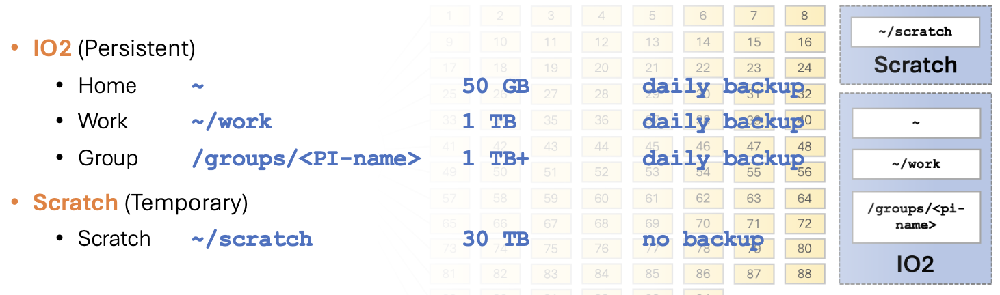

# Storage and Data Transfer

## Overview

Understanding where to store your data and how to move it efficiently is crucial for effective HPC usage. This guide covers Juno's storage systems and data transfer methods.

## Storage Systems on Juno



Juno has two storage tiers:

- **Io**: High-speed storage for programs and data in active use. Includes Home, Work, and Group directories.
- **Scratch**: Very high-performance storage for I/O-intensive batch jobs. Scratch is up to **10× faster** than Io for large I/O.

### Home Directory

**Path**: `~` (i.e., `/home/netID`)

**Purpose**: Configuration files, login scripts, user-installed software, small input/output files

**Characteristics**:

- ✓ Backed up daily
- ✓ Persistent (data retained indefinitely)
- ✓ Private to your account
- ✗ Quota: 50 GB
- ✗ Not suitable for batch job I/O

**Best for**:

- Source code and scripts
- Configuration files (`.bashrc`, SSH keys, etc.)
- Small reference datasets
- Job submission scripts

**Check your usage**:
```bash
mfsgetquota -H ~
```

Example output:
```
/home/dal281726:
soft quota grace period: 1w (default)
          |  curr |  soft | percent |  hard | percent |
 inodes   |   70k |  300k |   23.35 |  320k |   21.89 |
 length   |  44GB |     - |       - |     - |       - |
 size     |  48GB |  50GB |   96.43 |  55GB |   87.66 |
 realsize | 145GB |     - |       - |     - |       - |
```

`size` is the quota-enforced limit. `realsize` is the actual disk space consumed after replication — on Io, data is mirrored 3×, so realsize ≈ 3× size.

### Work Directory

**Path**: `~/work`

**Purpose**: User-installed software, large software packages, large data files, results files

**Characteristics**:

- ✓ Backed up daily
- ✓ Persistent (data retained indefinitely)
- ✓ Private to your account
- ✓ Quota: 1 TB
- ✓ Can be used for batch jobs with light to moderate I/O

**Best for**:

- Conda environments and large software installs
- Large datasets and results files

**Check your usage**:
```bash
mfsgetquota -H ~/work
```

### Group Directory

**Path**: `/groups/<pi-name>`

**Purpose**: Shared data for research groups

**Characteristics**:

- ✓ Shared among group members
- ✓ Quota: 1 TB or more (varies by group)
- ✓ Persistent storage
- ✓ Backed up daily
- ✓ Can be used for batch jobs with light to moderate I/O

**Best for**:

- Shared datasets and models
- Group software installations
- Collaborative project results

**Request group storage upgrade**: Contact [circ-assist@utdallas.edu](mailto:circ-assist@utdallas.edu)

### Scratch Space

**Path**: `~/scratch`

**Purpose**: High-speed temporary storage for I/O during batch jobs

**Characteristics**:

- ✓ Quota: 30 TB (soft limit)
- ✓ Up to 10× faster than Home/Work/Group for large I/O
- ✗ **Never backed up**
- ✗ Files not accessed for 45 days may be purged

See [Scratch Space Guide](scratch-space.md) for usage patterns, purge policy, and best practices.


## Storage Best Practices

### Directory Organization

**Recommended structure**:
```
/home/netID/
├── bin/              # Personal executables
├── scripts/          # Job scripts
├── src/              # Source code
│   ├── project1/
│   └── project2/
└── small_data/       # Small reference files

~/scratch
├── project1/
│   ├── input/
│   ├── output/
│   └── tmp/
└── project2/
    └── runs/
```

### Storage Selection Guide

| Data Type | Recommended Location |
|-----------|---------------------|
| Config files, `.bashrc` | Home |
| Source code and job scripts | Home or Work |
| Small datasets (<1 GB) | Home |
| Conda environments, large packages | Work |
| Large datasets (active use) | Work or Group |
| Job I/O during execution | Scratch |
| Shared group data | Group |
| Long-term results | Work or Group |

### Quota Management

**Check quotas**:
```bash
# Home directory quota
mfsgetquota -H ~

# Work directory quota
mfsgetquota -H ~/work

# Group directory quota
mfsgetquota -H /groups/groupname

# Scratch space usage
du -sh ~/scratch
```

**When approaching limits**:

1. Clean up old files
2. Compress large files
3. Move data to scratch
4. Archive to external storage
5. Request quota increase (if justified)

**Request quota increase**:

- Open ticket at HPC Services page
- Justify need with details
- Specify amount needed

## Data Transfer Methods

### Small Files (<100MB)

#### SCP (Secure Copy)

**Upload to Juno**:
```bash
# Single file
scp myfile.txt netID@juno.utdallas.edu:~

# Directory
scp -r mydir/ netID@juno.utdallas.edu:~
```

**Download from Juno**:
```bash
# Single file
scp netID@juno.utdallas.edu:~/results.txt ./

# Directory
scp -r netID@juno.utdallas.edu:~/scratch/output/ ./
```

#### SFTP (Secure File Transfer Protocol)

**Interactive session**:
```bash
sftp netID@juno.utdallas.edu

# SFTP commands:
put localfile.txt          # Upload
get remotefile.txt         # Download
put -r directory/          # Upload directory
get -r directory/          # Download directory
ls                         # List remote files
lls                        # List local files
cd ~/scratch               # Change remote directory
lcd ~/Downloads            # Change local directory
exit                       # Quit
```

**GUI clients**:

- **FileZilla**: Cross-platform, free
- **WinSCP**: Windows only, free
- **Cyberduck**: Mac/Windows, free

### Medium and Large Files (>100MB)

#### Rsync

**Advantages**:

- Only transfers changed files
- Resumes interrupted transfers
- Preserves permissions and timestamps
- Compression option

**Upload to Juno**:
```bash
rsync -avzP mydata/ netID@juno.utdallas.edu:~/scratch/mydata/
```

**Download from Juno**:
```bash
rsync -avzP netID@juno.utdallas.edu:~/scratch/results/ ./results/
```

**Common rsync options**:

- `-a`: Archive mode (preserves permissions, timestamps)
- `-v`: Verbose output
- `-z`: Compress during transfer
- `-P`: Show progress, enable resume
- `--exclude`: Skip certain files
- `--delete`: Remove files at destination not in source

**Example with exclusions**:
```bash
rsync -avzP --exclude='*.tmp' --exclude='*.log' \
  myproject/ netID@juno.utdallas.edu:~/scratch/myproject/
```

## Transfer Performance Tips

### Optimize Transfer Speed

**1. Use compression for text files**:
```bash
# With scp
scp -C largefile.txt netID@juno.utdallas.edu:~/scratch

# With rsync
rsync -z largefile.txt netID@juno.utdallas.edu:~/scratch
```

**2. Avoid compression for already-compressed files**:

- Don't compress .gz, .zip, .bz2, .mp4, .jpg, etc.
- Adds overhead without benefit

**3. Use parallel transfers for multiple files**:
```bash
# GNU parallel with rsync
parallel -j 4 rsync -avzP {} netID@juno.utdallas.edu:~/scratch ::: file1 file2 file3 file4
```

**4. Transfer during off-peak hours**:

- Late evening/early morning typically faster
- Less network congestion

**5. Compress before transfer**:
```bash
# Create compressed archive
tar czf data.tar.gz large_dataset/

# Transfer compressed file
scp data.tar.gz netID@juno.utdallas.edu:~/scratch

# On Juno, extract
ssh netID@juno.utdallas.edu
cd ~/scratch
tar xzf data.tar.gz
```

### Transfer from Compute Node

For very large transfers that may take hours:

**Submit as a job**:
```bash
#!/bin/bash
#SBATCH -J data_transfer
#SBATCH -o transfer_%j.log
#SBATCH -p normal
#SBATCH -N 1
#SBATCH -c 1
#SBATCH --mem=4GB
#SBATCH -t 12:00:00

# Transfer data
rsync -avzP ~/scratch/large_output/ \
  username@remote-server.edu:/data/destination/
```

## Data Compression

### When to Compress

**Compress**:

- Text files (code, logs, CSV)
- Uncompressed images
- Before long-term storage
- Before transfer (if not already compressed)

**Don't compress**:

- Already compressed files
- Files needed for immediate processing
- Small files (overhead not worth it)

### Compression Tools

For the command syntax of `gzip`, `bzip2`, `tar`, and `zip`, see the [compression reference in the Linux Commands guide](../working-on-juno/linux-commands.md#compression-and-archives). A common pattern before transferring a directory:

```bash
tar czf data.tar.gz large_dataset/    # archive + compress
scp data.tar.gz netID@juno.utdallas.edu:~/scratch
ssh netID@juno.utdallas.edu 'cd ~/scratch && tar xzf data.tar.gz'
```

## Data Management Best Practices

### Data Lifecycle

A typical workflow stages data into scratch, computes there, then saves results to backed-up storage. See [Scratch Space](scratch-space.md#recommended-workflow) for the full lifecycle and cleanup commands.

### Backup Strategy

**Critical Data:** Never rely solely on HPC storage for critical data. Always maintain backups.

**Backup destinations**:

- Personal computer
- External hard drive
- UT Dallas cloud storage (Box)
- Research data repositories
- Cloud services (Google Drive, Dropbox, etc.)

## Data Security

### File Permissions

**Check permissions**:
```bash
ls -la filename
```

**Set appropriate permissions**:
```bash
# Private file (only you can read/write)
chmod 600 sensitive_data.txt

# Private directory
chmod 700 private_directory/

# Group-readable
chmod 640 shared_data.txt
```

### Sensitive Data

If working with sensitive data (HIPAA, FERPA, export-controlled):

1. **Verify approval** to use HPC for this data
2. **Encrypt** sensitive files
3. **Limit access** with proper permissions
4. **Follow institutional policies**
5. **Contact support** for guidance

## Troubleshooting

### Transfer Interrupted

**Rsync to resume**:
```bash
# Rsync automatically resumes
rsync -avzP --partial source/ destination/
```

### Slow Transfers

**Check**:

1. Network speed: `ping juno.utdallas.edu`
2. Transfer during off-peak hours
3. Use compression for text files
4. Check local network (WiFi vs Ethernet)

### Permission Denied

```bash
# Check file ownership
ls -l filename

# If you own it, fix permissions
chmod 755 filename
```

### Quota Exceeded

```bash
# Check usage
quota -s

# Find large files
du -sh /home/$USER/* | sort -h

# Clean up or request increase
```

### Can't Find Transferred Files

```bash
# Verify transfer completed
ls -lh destination/

# Check transfer logs
# For rsync, run with -v flag
```

## Quick Reference

### Common Commands

```bash
# Check quota
mfsgetquota -H ~

# Disk usage
du -sh ~/scratch

# Transfer files
scp file.txt netID@juno.utdallas.edu:~/scratch
rsync -avzP directory/ netID@juno.utdallas.edu:~/scratch/directory/

# Compress/decompress
gzip file.txt
tar czf archive.tar.gz directory/
tar xzf archive.tar.gz

# Find large files
find ~/scratch -size +1G -ls
```

### Storage Locations Quick Guide

| Location | Path | Quota | Backup | Use For |
|----------|------|-------|--------|---------|
| Home | `~` | 50 GB | Yes (daily) | Config, scripts, small data |
| Work | `~/work` | 1 TB | Yes (daily) | Large software, data, results |
| Scratch | `~/scratch` | 30 TB | Never | High-speed I/O during batch jobs |
| Group | `/groups/<pi-name>` | 1 TB+ | Yes (daily) | Shared group data |

## Next Steps

- [Learn about scratch space policies →](scratch-space.md)
- [Start submitting jobs →](../running-programs/slurm.md)
- [Optimize your workflows →](../advanced/python-optimization.md)

## Need Help?

- **Data transfer issues**: [circ-assist@utdallas.edu](mailto:circ-assist@utdallas.edu)
- **Quota requests**: Open ticket at HPC Services page
