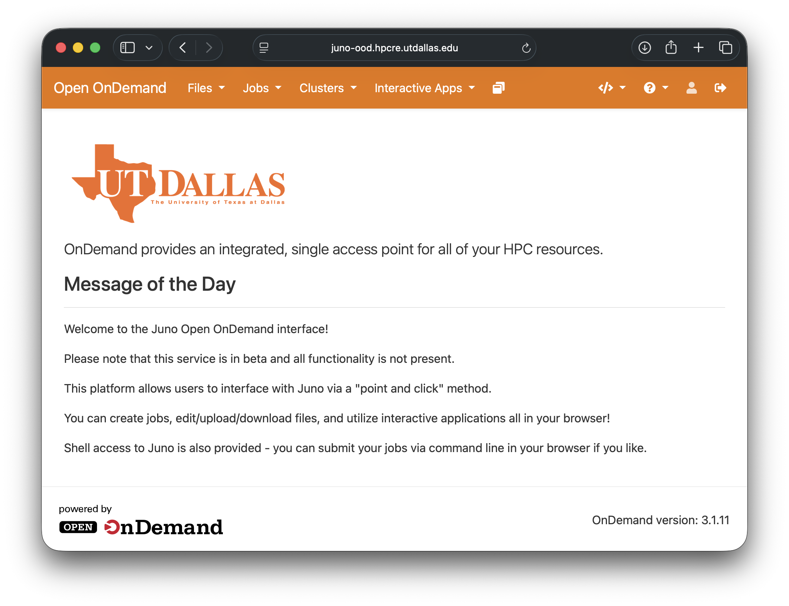
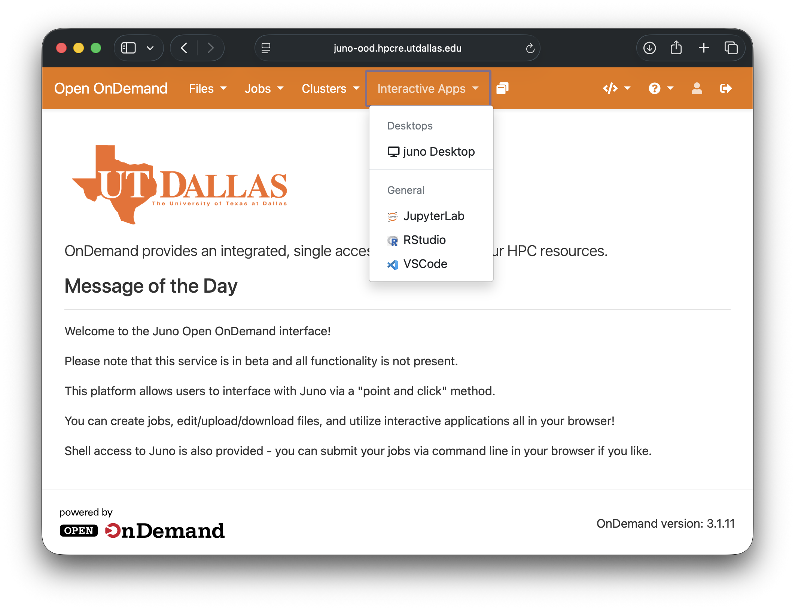
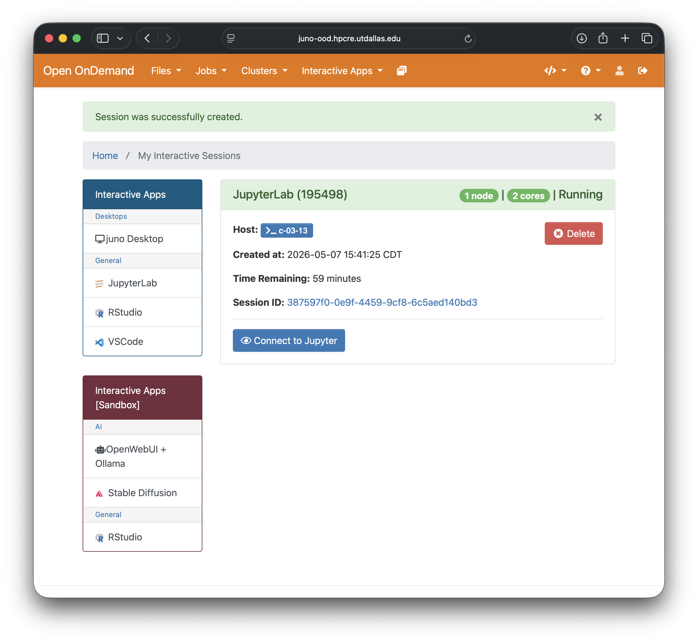
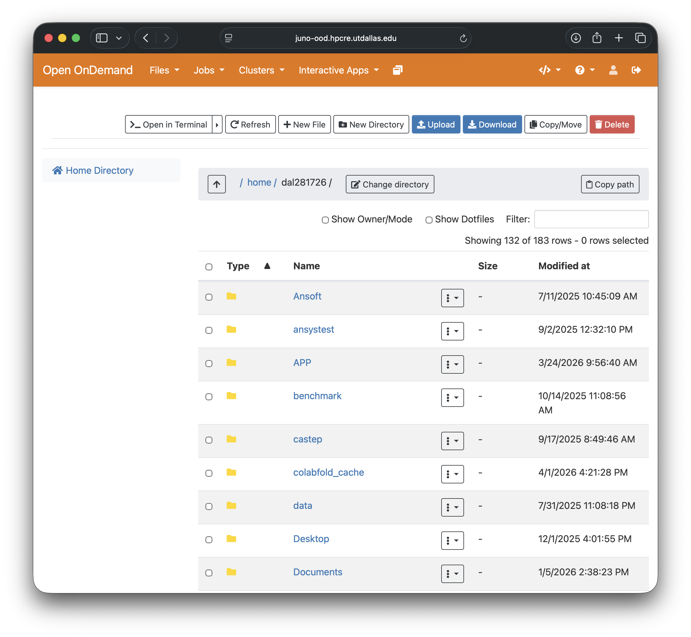

# Launching GUI Programs

## Overview

Juno supports running graphical user interface (GUI) programs through two main methods:

1. **Open OnDemand** (Web-based, recommended)
2. **X Window System** (Traditional X11 forwarding)

## Open OnDemand (Recommended)

Open OnDemand provides a web-based interface to access Juno resources without installing additional software.

### Accessing Open OnDemand

1. Open your web browser
2. Navigate to: `https://juno-ood.hpcre.utdallas.edu/`
3. Log in with your Juno credentials
4. You'll see the Open OnDemand dashboard



### Dashboard Features

**Files**

- Browse your home directory
- Upload/download files
- Edit text files directly in browser
- Create new directories

**Jobs**

- View active jobs
- Job composer for creating job scripts
- Job templates

**Clusters**

- Shell access (web-based terminal)
- No SSH client needed

**Interactive Apps**

- Pre-configured GUI applications
- Launch with a few clicks

### Launching Interactive Apps

#### Available Applications

Common interactive apps include:

- Jupyter Notebook/Lab
- RStudio
- Desktop (full Linux desktop environment)
- VSCode Server

#### Starting an Interactive App

1. Click **Interactive Apps** in the top menu
2. Select your desired application (e.g., "Jupyter Notebook")

   

3. Fill in the resource request form:
   - **Number of hours**: How long you need (e.g., 2, 4, 8)
   - **Number of cores**: CPUs needed (typically 1-4 for interactive work)
   - **Memory (GB)**: RAM required (e.g., 4, 8, 16)
   - **Partition**: Usually "normal" for CPU, "h100" or "a30" for GPU work

   

4. Click **Launch**

5. Wait for resources to be allocated (you'll see status: Queued → Starting → Running)

   

6. Click **Connect to [Application]** when ready

#### Jupyter Notebook Example

```
Interactive Apps → Jupyter Notebook

Settings:
- Number of hours: 4
- Number of cores: 2  
- Memory: 8GB
- Partition: normal

Launch → Wait for allocation → Connect to Jupyter
```

Your Jupyter session opens in a new browser tab running on a compute node!

#### RStudio Example

```
Interactive Apps → RStudio

Settings:
- Number of hours: 2
- Number of cores: 4
- Memory: 16GB
- Partition: normal

Launch → Connect to RStudio
```

### Managing Interactive Sessions

**View Active Sessions**:

- Go to "My Interactive Sessions"
- See all running interactive apps
- Click "Delete" to end session early
- Click application link to reconnect

**Best Practices**:

- Request only the resources you need
- End sessions when finished (don't waste resources)
- Sessions automatically end when time expires

### File Management via Web

**Upload Files**:

1. Click **Files** → **Home Directory**
2. Navigate to destination folder
3. Click **Upload** button
4. Select files from your computer

**Download Files**:

1. Navigate to file location
2. Check the box next to file(s)
3. Click **Download**

**Edit Files**:

1. Click on text file
2. Click **Edit** button
3. Make changes in browser
4. Click **Save**



!!! note
    The upload/download limit is 10GB/file

---

## X Window System (X11 Forwarding)

For users who prefer command-line access or need specific GUI programs not available in Open OnDemand.

### Prerequisites

Install an X server on your local computer:

**Mac**

**Install XQuartz**:
    
1. Download from [xquartz.org](https://www.xquartz.org/)
2. Install the .dmg file
3. **Log out and log back in** (required)
4. Open XQuartz
5. Use the XQuartz terminal for SSH

**Windows**

**Install MobaXterm** (Recommended):
    
1. Download from [mobaxterm.mobatek.net](https://mobaxterm.mobatek.net/)
2. Choose Home Edition (free)
3. Install the software
4. X server starts automatically with MobaXterm
5. Use MobaXterm's built-in terminal
    
**Alternative: Xming**:
    
1. Download [Xming](https://sourceforge.net/projects/xming/)
2. Install Xming
3. Start Xming from Start menu
4. Use PowerShell or PuTTY with X11 forwarding enabled

**Linux**

X11 is typically pre-installed. No additional software needed.

### Logging In with X11

```bash
ssh -X netID@juno.utdallas.edu
```

!!! note
    Use capital `-X` for X11 forwarding, not lowercase `-x`

**For slower connections, use compression**:
```bash
ssh -XC netID@juno.utdallas.edu
```

### Testing X11 Forwarding

After logging in with `-X`, test with a simple program:

```bash
xclock
```

If a clock appears on your screen, X11 forwarding is working correctly!

### Running GUI Programs on Login Node

!!! note
    Only use login nodes for quick tests or launching programs that will run on compute nodes.

```bash
# Test X11
xclock

# Launch MATLAB (from login node, not recommended for computation)
module load matlab/r2024b
matlab
```

### Running GUI Programs on Compute Nodes

**Recommended approach**: Request resources, then launch GUI program.


```bash
# Step 1: Request resources on login node
salloc -p normal --mem=8GB -c 4 -t 2:00:00

# Step 2: Check which nodes are assigned
squeue --me

# Step 3: Start interactive session with X11
ssh -X c-XX-YY             # Node c-XX-YY was assigned

# Now on compute node, launch GUI program
module load matlab/r2024b
matlab
```

Your prompt changes from `juno-l-01` to `c-XX-YY`, indicating you're on a compute node.


### Common GUI Applications

#### MATLAB

```bash
# Load MATLAB module
module load matlab/r2024b

# Launch MATLAB GUI
matlab

# Or run MATLAB script without GUI
matlab -nodisplay -nosplash -r "run('script.m'); exit;"
```

#### Ansys Fluent

```bash
module load ansys/2025R1
fluent
```

#### Stata

```bash
module load stata/19.5
xstata

```

### Troubleshooting X11

#### "Cannot open display" error

**Problem**: X11 forwarding not working

**Solutions**:

1. **Verify X server is running** on your local machine
   - Mac: Check XQuartz is running
   - Windows: Check MobaXterm or Xming is running

2. **Check DISPLAY variable**:
   ```bash
   echo $DISPLAY
   ```
   Should show something like `localhost:10.0`

3. **Re-login with -X flag**:
   ```bash
   ssh -X netID@juno.utdallas.edu
   ```

4. **Try -Y instead of -X** (Mac users):
   ```bash
   ssh -Y netID@juno.utdallas.edu
   ```

5. **Check SSH config**:
   Add to `~/.ssh/config` on your local machine:
   ```
   Host juno
       HostName juno.utdallas.edu
       User your_username
       ForwardX11 yes
       ForwardX11Trusted yes
   ```

#### Slow Performance

**Problem**: GUI is laggy or unresponsive

**Solutions**:

1. **Enable compression**:
   ```bash
   ssh -XC netID@juno.utdallas.edu
   ```

2. **Reduce color depth** (if using VNC/remote desktop)

3. **Consider using Open OnDemand** instead (better for slow connections)

4. **Close unnecessary windows and programs**

#### X11 Works on Login but Not Compute Node


**Solution**: Use `-X` flag when you log in to the compute node:
```bash
ssh -X c-XX-YY
```

### X11 Configuration Tips

#### SSH Config File

Create `~/.ssh/config` on your local machine:

```
Host juno
    HostName juno.utdallas.edu
    User your_username
    ForwardX11 yes
    ForwardX11Trusted yes
    Compression yes
```

Now you can simply:
```bash
ssh juno
```

#### Keep Connection Alive

Add to SSH config:
```
Host juno
    ServerAliveInterval 60
    ServerAliveCountMax 3
```

---

## Comparison: Open OnDemand vs X11

| Feature | Open OnDemand | X11 Forwarding |
|---------|---------------|----------------|
| **Setup** | Just a browser | Requires X server install |
| **Performance** | Better for slow networks | Can be slow over internet |
| **Applications** | Pre-configured apps | Any GUI program |
| **File Management** | Easy web interface | Command line |
| **Session Persistence** | Survives browser close | Closes with SSH disconnect |
| **Best For** | Most users, interactive work | Power users, specific tools |

## Best Practices

1. **Choose the right method**:
   - Open OnDemand for most interactive work
   - X11 for specialized programs not in OnDemand

2. **Request appropriate resources**:
   - Start with modest requests (2-4 cores, 8GB RAM)
   - Scale up if needed

3. **End sessions when done**:
   - Don't leave interactive sessions running unnecessarily
   - Fair share applies to interactive jobs too

4. **Test on login node first** (briefly):
   - Verify program launches
   - Then move to compute nodes

5. **Use tmux/screen with X11**:
   ```bash
   # Start tmux before requesting resources
   tmux new -s gui_session
   salloc ...
   ```

## Example Workflows

### Workflow 1: Jupyter Notebook via OnDemand

1. Open browser → OnDemand portal
2. Interactive Apps → Jupyter Notebook
3. Request: 4 hours, 2 cores, 8GB, normal partition
4. Launch and connect
5. Work in notebook
6. Save files
7. End session when done

### Workflow 2: MATLAB with X11

1. Open XQuartz terminal (Mac) or MobaXterm (Windows)
2. `ssh -X netID@juno.utdallas.edu`
3. `salloc -p normal --mem=16GB -c 4 -t 4:00:00`
4. `squeue --me`
5. `ssh -X c-XX-YY`
6. `module load matlab/r2024b`
7. `matlab`
8. Work in MATLAB GUI
9. Exit MATLAB
10. `exit` from compute node
11. `exit` from login node

### Workflow 3: RStudio via OnDemand

1. OnDemand portal → Interactive Apps → RStudio Server
2. Configure: 3 hours, 4 cores, 12GB
3. Launch
4. Connect to RStudio
5. Load your R scripts and data
6. Run analyses
7. Save results
8. End session

## Next Steps

- [Set up VSCode for remote development →](vscode.md)
- [Learn about containerized applications →](../advanced/containers.md)
- [Optimize your interactive workflows →](../running-programs/slurm.md)

## Need Help?

- **Email**: [circ-assist@utdallas.edu](mailto:circ-assist@utdallas.edu)
- **HPC Services**: [hpc.utdallas.edu/services](https://hpc.utdallas.edu/services)
- **Open a ticket**: For specific GUI application requests or issues