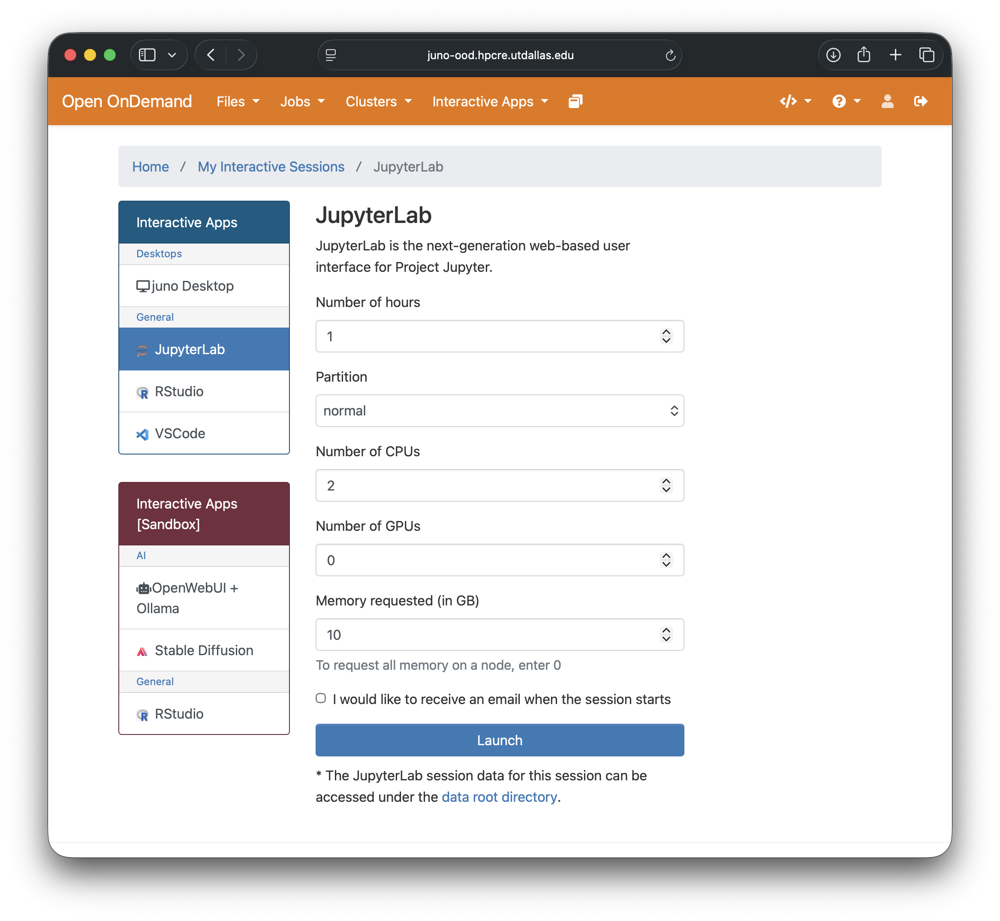
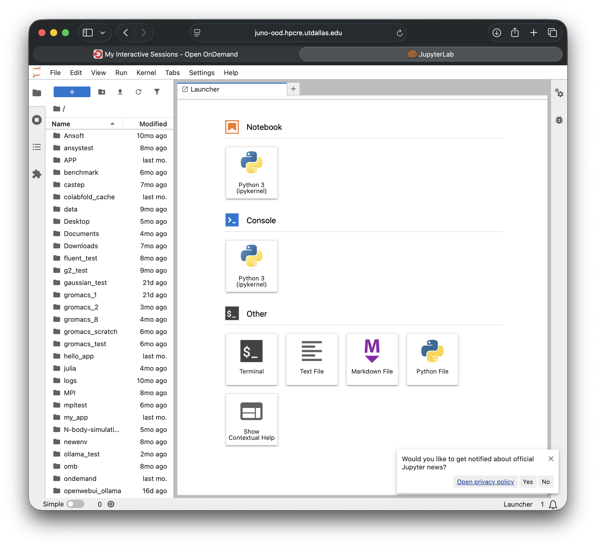
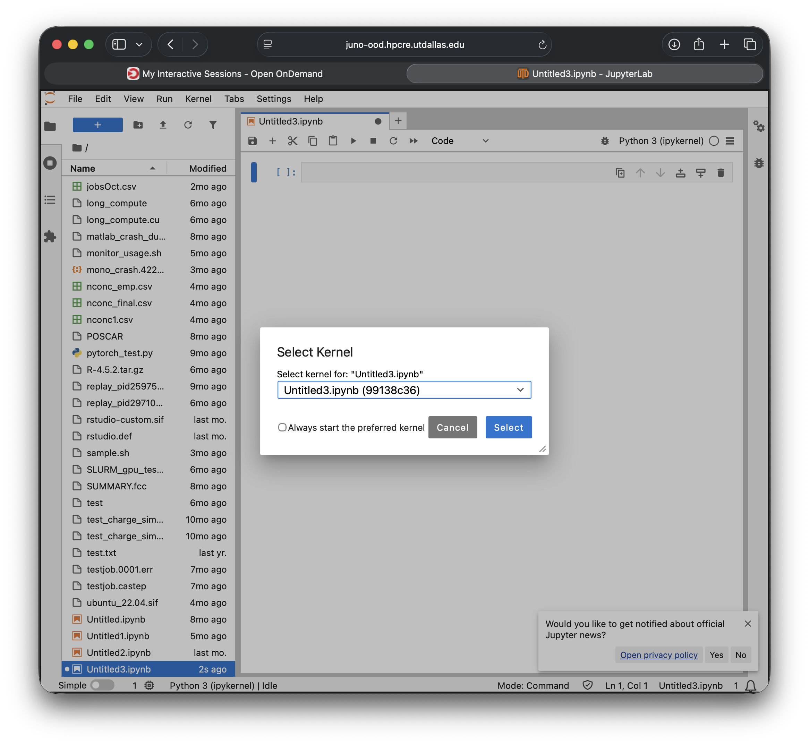

# JupyterLab on Juno

There are two ways to run JupyterLab on the cluster. Choose based on your workflow:

| Method | Best for |
|---|---|
| **Open OnDemand** | Most users — no terminal setup, survives browser close, easy reconnect |
| **SSH port forwarding** | Full control over a specific conda environment, GPU work with custom builds, or advanced multi-session workflows |

Both methods run JupyterLab on a **compute node** — never on the login node.

---

## Method 1 — JupyterLab via Open OnDemand (Recommended)

Open OnDemand launches JupyterLab for you through a web form. No SSH tunneling required.

### Step 1 — Open the portal

Navigate to [https://juno-ood.hpcre.utdallas.edu/](https://juno-ood.hpcre.utdallas.edu/) and log in with your UT Dallas NetID.

> **Off-campus users:** connect to the UT Dallas VPN before accessing the portal.

### Step 2 — Request a JupyterLab session

1. Click **Interactive Apps** in the top menu bar.
2. Select **Jupyter Lab**.
3. Fill in the resource form:

   | Field | Typical value | Notes |
   |---|---|---|
   | Number of hours | 4 | Max 48 |
   | Number of cores | 2–4 | Scale up for parallel work |
   | Memory (GB) | 8–16 | |
   | Partition | `normal` | Use `a30` or `h100` for GPU |
   | GPU | 1 *(optional)* | Only for GPU partitions |

   

4. Click **Launch**.

### Step 3 — Connect

The session moves through **Queued → Starting → Running**. When it is ready, click **Connect to Jupyter Lab**. A full JupyterLab interface opens in a new browser tab running on your allocated compute node.



> **Session persistence:** if you close the browser tab or lose your connection, your session keeps running. Return to the portal, click **My Interactive Sessions**, and click the link to reconnect.

---

### Using a conda environment in Open OnDemand JupyterLab

Open OnDemand launches JupyterLab from the system Python, **outside any conda environment**. To use packages from your own conda environment, register it as a Jupyter kernel first. You only need to do this once per environment.

#### One-time kernel registration

Open a terminal on Juno (via the portal: **Clusters → Juno Shell Access**, or via SSH) and run:

```bash
module load miniconda
conda activate /path/to/myenv        # activate your environment
conda install -y ipykernel           # install the kernel bridge (skip if already installed)
python -m ipykernel install --user \
    --name myenv \
    --display-name "Python (myenv)"  # name shown in JupyterLab
```

Replace `/path/to/myenv` with the full path to your environment and choose a display name that is meaningful to you (e.g. `"Python (ml-gpu)"` or `"Python (accel-py)"`).

#### Select the kernel in JupyterLab

After connecting to your Open OnDemand session:

1. Open a notebook (or create a new one).
2. Click the kernel name in the top-right corner of the notebook (e.g. "Python 3").
3. Select your registered kernel from the list (e.g. **Python (myenv)**).



The kernel indicator updates and your notebook now runs inside your conda environment.

> **Kernel not appearing?** The registration only needs to run once, but it must complete before you start the JupyterLab session. If you registered the kernel while a session was already running, restart the JupyterLab server: **File → Hub Control Panel → Stop My Server**, then relaunch from the portal.

---

## Method 2 — SSH Port Forwarding

Use this method when you want to launch JupyterLab directly from within a conda environment — useful for workflows that depend on a tightly controlled software stack or where registering a kernel is not practical.

```
  Your machine          Login node            Compute node
  ┌────────────┐        ┌─────────────┐       ┌──────────────────────┐
  │            │        │             │       │                      │
  │  Browser   │        │  juno-l-01  │       │  g-05-01  (SLURM)    │
  │            │        │             │       │                      │
  │ localhost  │  SSH   │             │ net   │  JupyterLab          │
  │   :8888    │◄──────►│             │◄─────►│    :8888             │
  │            │ tunnel │             │       │                      │
  └────────────┘        └─────────────┘       └──────────────────────┘
  Your browser talks to localhost; the SSH tunnel forwards traffic
  through the login node to JupyterLab on the compute node.
```

### Prerequisites

- SSH access to `juno.utdallas.edu`
- A conda environment with JupyterLab installed (`conda install jupyterlab`)
- A second terminal window you can open on your **local machine**

### Step 1 — Log in to the cluster

```bash
ssh <netID>@juno.utdallas.edu
```

Your prompt becomes:

```
[<netID>@juno-l-01 ~]$
```

### Step 2 — Request a compute node

**CPU-only** (data analysis, profiling):

```bash
salloc -p normal -N 1 -c 4 --mem=16GB -t 4:00:00
```

**GPU — A30** (CuPy, CUDA):

```bash
salloc -p a30 -N 1 -c 4 --mem=16GB --gres=gpu:1 -t 4:00:00
```

**GPU — H100** (large-scale deep learning):

```bash
salloc -p h100 -N 1 -c 4 --mem=16GB --gres=gpu:1 -t 4:00:00
```

SLURM confirms the allocation and prints the node name:

```
salloc: Granted job allocation 123456
salloc: Nodes g-05-01 are ready for job
```

### Step 3 — Identify your compute node

```bash
echo $SLURM_NODELIST
```

Example output: `g-05-01`. Keep this name — you need it in Steps 4 and 6.

### Step 4 — SSH into the compute node

Still in the **same terminal**, log in to the node by name:

```bash
ssh <netID>@g-05-01
```

Your prompt changes to:

```
[<netID>@g-05-01 ~]$
```

### Step 5 — Activate your environment and launch JupyterLab

```bash
module load miniconda
conda activate /path/to/myenv
jupyter lab --no-browser --ip=0.0.0.0 --port=8888
```

JupyterLab prints its URL. Copy the line that includes the token:

```
[I] Jupyter Server is running at:
    http://g-05-01:8888/lab
    http://127.0.0.1:8888/lab?token=a3f8bc...  ← copy this
```

Leave this terminal running — closing it kills JupyterLab.

> **Port in use?** Another user may be on the same port. Change to any free port:
> `--port=18888`. Use the same number in Step 6.

### Step 6 — Open the SSH tunnel on your local machine

**Open a new terminal on your local machine** and run:

```bash
ssh -N -L 8888:g-05-01:8888 <netID>@juno.utdallas.edu
```

| Part | Meaning |
|---|---|
| `-N` | Tunnel only — no remote command |
| `-L 8888:g-05-01:8888` | Forward `localhost:8888` → login node → `g-05-01:8888` |
| `<netID>@juno.utdallas.edu` | Entry point (any login node works) |

The command appears to hang with no output — that is correct. Do not close this terminal.

### Step 7 — Open JupyterLab in your browser

Navigate to:

```
http://localhost:8888
```

If prompted for a token, paste the value from Step 5. You are now running JupyterLab on the compute node, rendered in your local browser.

### Step 8 — Shut everything down cleanly

1. **In JupyterLab:** File → Shut Down.
2. **In the compute-node terminal (Step 5):** press `Ctrl-C`, then `exit`.
3. **In the tunnel terminal (Step 6):** press `Ctrl-C`.
4. **On the login node:** release your allocation:

   ```bash
   exit
   ```

   Or cancel it explicitly:

   ```bash
   scancel $SLURM_JOB_ID
   ```

> Releasing unused allocations promptly frees resources for other users and preserves your fair-share score.

---

## When to use which method

| Scenario | Open OnDemand | SSH port forwarding |
|---|---|---|
| Quick analysis or exploration | ✓ Recommended | Works but more setup |
| Custom conda environment | ✓ Register kernel (one-time) | ✓ Launch directly inside env |
| GPU work | ✓ Select GPU partition in form | ✓ Request GPU with `salloc` |
| Slow or unstable network | ✓ Better — session survives disconnect | Session drops if SSH breaks |
| Multiple Jupyter sessions | One per OOD job | One per tunnel — run multiple |
| Need `tmux` / session persistence | Not needed (OOD handles it) | ✓ Use tmux (see Tips below) |
| Off-campus without VPN | ✗ VPN required | ✗ VPN required |
| First-time user | ✓ Much easier | Steeper learning curve |

**Rule of thumb:** start with Open OnDemand. Switch to port forwarding only when you need tighter control over the environment than a registered kernel provides.

---

## Tips (SSH port forwarding)

### Avoid port conflicts

Choose a personal port derived from your user ID:

```bash
PORT=$((10000 + ($(id -u) % 9000)))
jupyter lab --no-browser --ip=0.0.0.0 --port=$PORT
```

Use the same `$PORT` in the `-L` flag in Step 6.

### Keep JupyterLab alive across dropped connections

Start JupyterLab inside a `tmux` session so it survives SSH disconnects:

```bash
tmux new -s jlab
# inside tmux:
module load miniconda && conda activate /path/to/myenv
jupyter lab --no-browser --ip=0.0.0.0 --port=8888
# Ctrl-B then D  →  detach; JupyterLab keeps running
```

Reattach after reconnecting to the node:

```bash
ssh <netID>@g-05-01
tmux attach -t jlab
```

### Simplify with an SSH config entry

Add this block to `~/.ssh/config` on your **local machine**:

```
Host juno
    HostName juno.utdallas.edu
    User <netID>
    ForwardX11 yes
    Compression yes
```

After that, the tunnel command shortens to:

```bash
ssh -N -L 8888:g-05-01:8888 juno
```

---

## Need Help?

- **Email:** [circ-assist@utdallas.edu](mailto:circ-assist@utdallas.edu)
- **Open OnDemand issues:** include the session ID shown in "My Interactive Sessions"
- **Port forwarding issues:** include the output of `squeue --me` and the exact error message

## Related guides

- [Open OnDemand →](open-ondemand.md)
- [Launching GUI Programs (X11) →](gui-programs.md)
- [Virtual Environments with Miniconda →](../advanced/miniconda.md)
- [SLURM Job Scheduler →](../running-programs/slurm.md)
