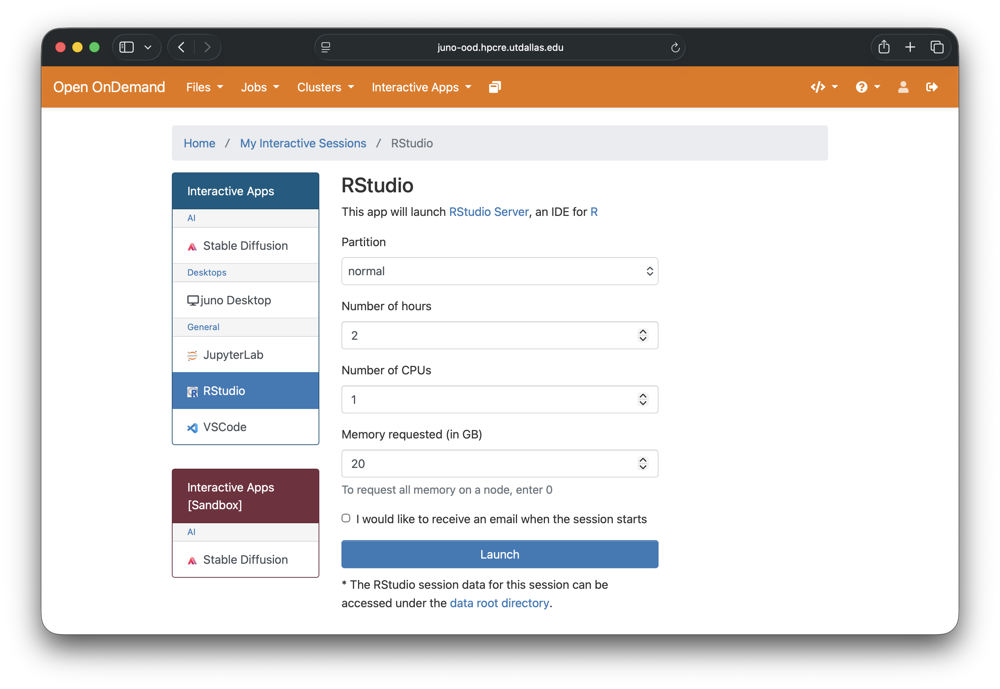
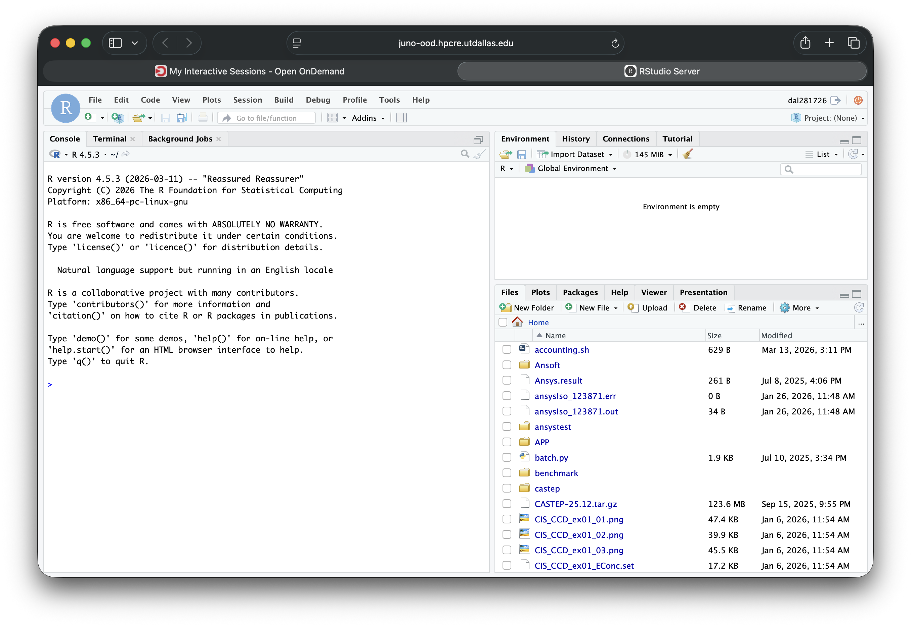

# RStudio on Juno

## Overview

There are two ways to work with R on the cluster. Choose based on your workflow:

| Method | Best for |
|---|---|
| **RStudio via Open OnDemand** | Interactive analysis — the full RStudio IDE in your browser, no terminal setup, survives browser close |
| **R from a compute-node terminal** | Scripted, batch, or long-running jobs (`Rscript`), and pipelines launched with SLURM |

Both run on a **compute node** — never on the login node. This page focuses on the interactive RStudio IDE; for batch R see [Running Common Scientific Programs](../running-programs/common-programs.md#r).

---

## Method 1 — RStudio via Open OnDemand (Recommended)

Open OnDemand launches RStudio Server for you through a web form. No SSH tunneling required.

### Step 1 — Open the portal

Navigate to [https://juno-ood.hpcre.utdallas.edu/](https://juno-ood.hpcre.utdallas.edu/). A pop-up window will prompt you to enter your NetID credentials — sign in with your UT Dallas NetID and password.

> **Off-campus users:** connect to the UT Dallas VPN before accessing the portal.

### Step 2 — Request an RStudio session

1. Click **Interactive Apps** in the top menu bar.
2. Select **RStudio Server**.
3. Fill in the resource form:

   | Field | Typical value | Notes |
   |---|---|---|
   | Number of hours | 4 | Max 48 |
   | Number of cores | 2–4 | Scale up for parallel work |
   | Memory (GB) | 8–16 | Increase for large datasets |
   | Partition | `normal` | Use `a30` or `h100` for GPU work |
   | R version / environment | `R/4.5.0` | Or your own conda environment (see below) |

   <!-- SCREENSHOT PLACEHOLDER: RStudio launch form -->
   

4. Click **Launch**.

### Step 3 — Connect

The session moves through **Queued → Starting → Running**. When it is ready, click **Connect to RStudio Server**. The full RStudio IDE opens in a new browser tab running on your allocated compute node.

<!-- SCREENSHOT PLACEHOLDER: RStudio IDE running in browser -->


> **Session persistence:** if you close the browser tab or lose your connection, your session keeps running. Return to the portal, click **My Interactive Sessions**, and click the link to reconnect.

---

### Using a conda environment with R packages in RStudio

RStudio starts with a base R installation that may not include the packages your project needs. The recommended way to get a reproducible set of R packages is to build a **conda environment** that contains R and your packages, then point your RStudio session at it. You only need to build the environment once.

#### Step 1 — Build a conda environment with R and your packages

Open a terminal on Juno (via the portal: **Clusters → Juno Shell Access**, or via SSH) and create an environment with `r-base` plus the packages you need from the `conda-forge` channel:

```bash
module load miniconda
conda create -p ~/work/r-env -c conda-forge \
    r-base \
    r-tidyverse \
    r-data.table \
    r-essentials       # add any other r-<package> you need
```

Conda package names are the CRAN name prefixed with `r-` and lower-cased (e.g. `ggplot2` → `r-ggplot2`, `data.table` → `r-data.table`).

#### Step 2 — Make the environment available to RStudio

```bash
# Run once in a terminal — points R at your conda env's package library
echo 'R_LIBS_USER=~/work/r-env/lib/R/library' >> ~/.Renviron
```

`R_LIBS_USER` is read by R at startup, so the next RStudio session you launch will find the packages installed in that environment.

#### Step 3 — Verify inside RStudio

In the RStudio **Console**, confirm R can see the library and load a package:

```r
.libPaths()              # should list your conda env's library path
library(tidyverse)       # loads without error if the env is active
```

> **Packages not found?** Make sure the environment was selected (or `~/.Renviron` was saved) **before** the session started. If you changed it while a session was running, end the session from **My Interactive Sessions** and launch a fresh one.

#### Alternative — a personal package library

If you prefer to add packages to RStudio's existing R rather than build a conda environment, install them into a writable personal library:

```r
dir.create("~/work/Rlibs", recursive = TRUE, showWarnings = FALSE)
.libPaths("~/work/Rlibs")
install.packages(c("tidyverse", "data.table"))
```

Persist the library across sessions by adding it to `~/.Renviron`:

```bash
echo 'R_LIBS_USER=~/work/Rlibs' >> ~/.Renviron
```

---

## Method 2 — R from a compute-node terminal

Use this for scripted or non-interactive work — running an `.R` file end to end, batch jobs, or pipelines. Request a compute node, load the R module (or activate your conda environment), and run `Rscript`:

```bash
salloc -p normal -N 1 -c 4 --mem=16GB -t 4:00:00
srun --pty bash
module load R/4.5.0
Rscript analysis.R
```

For unattended runs, submit it as a SLURM batch job instead — see the [R batch job example](../running-programs/common-programs.md#r).

---

## Managing Interactive Sessions

- Go to **My Interactive Sessions** to see all running interactive apps.
- Click the session link to reconnect, or **Delete** to end a session early.
- Sessions end automatically when their requested time expires.
- Request only the resources you need, and end sessions when finished so you don't hold resources idle.

---

## Tips

- **Right-size memory.** RStudio holds your data frames in RAM. If a session is killed unexpectedly, relaunch with more memory (GB) — you can check a job's peak memory (`MaxRSS`) afterward via [job history](../running-programs/slurm.md#check-job-history).
- **Keep projects on `~/work`.** Build conda environments and store package libraries under `~/work` (backed up, 1 TB) rather than home (50 GB).
- **Reproducibility.** Record your environment with `conda env export -p ~/work/r-env > r-env.yml` so collaborators can rebuild it. See [Sharing Environments with Your Research Group](../advanced/miniconda.md#sharing-environments-with-your-research-group).

---

## Need Help?

- **Email:** [circ-assist@utdallas.edu](mailto:circ-assist@utdallas.edu)
- **RStudio / Open OnDemand issues:** include the session ID shown in "My Interactive Sessions"
- **Missing R packages:** include the exact `install.packages()` or `library()` error message

## Related guides

- [Open OnDemand →](open-ondemand.md)
- [JupyterLab on Juno →](jupyter.md)
- [Virtual Environments with Miniconda →](../advanced/miniconda.md)
- [Running Common Scientific Programs (R) →](../running-programs/common-programs.md#r)
