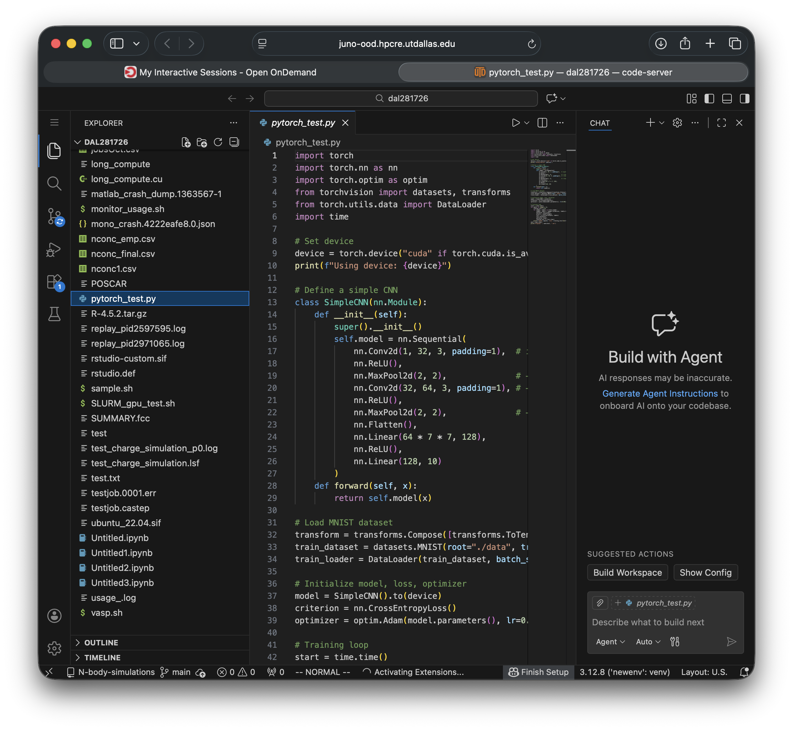

# VSCode on Juno

## Overview

Visual Studio Code can run on Juno through **Open OnDemand**, which launches a browser-based VSCode (`code-server`) on a compute node with full CPU, memory, and GPU resources.

!!! warning "Don't point Remote-SSH at a login node"
    Don't aim the VSCode **Remote-SSH** extension at a regular **login node** — these are limited to ~8 GB of RAM and are not meant for running code or development tools. Indexing a project, opening large files, or running extensions there can crash your session and degrade the login node for everyone. Use [Open OnDemand](#launching-vscode-via-open-ondemand) for the full IDE-on-a-compute-node experience, or, if you specifically need Remote-SSH, connect to the dedicated [`juno-vscode` node](#remote-ssh-to-the-dedicated-vscode-node) described below.

## Why VSCode on Juno?

- Full IDE experience (syntax highlighting, IntelliSense, search) on the cluster
- Integrated terminal for loading modules and submitting jobs
- File browser for the Juno filesystem
- Built-in Git integration and Jupyter notebook support
- No X11 forwarding required

## Launching VSCode via Open OnDemand

1. Open your browser and go to [https://juno-ood.hpcre.utdallas.edu/](https://juno-ood.hpcre.utdallas.edu/) (connect to the UT Dallas VPN first if off-campus).
2. Log in with your UT Dallas NetID.
3. Click **Interactive Apps** → **VSCode Server**.
4. Fill in the resource form:
   - **Number of hours** — how long you need (e.g. 4)
   - **Number of cores** — typically 2–4 for interactive work
   - **Memory (GB)** — e.g. 8–16
   - **Partition** — `normal` for CPU work, `h100` or `a30` for GPU work
5. Click **Launch** and wait for the status to reach **Running**.
6. Click **Connect to VSCode**.



For general Open OnDemand usage (managing sessions, file uploads), see [Open OnDemand](open-ondemand.md).

## Remote-SSH to the dedicated VSCode node

If you prefer to run VSCode on **your own laptop or desktop** and connect to Juno over SSH, use the dedicated `juno-vscode` node. Unlike a login node, this host is provisioned specifically for the Remote-SSH workflow.

!!! warning "Testing phase"
    `juno-vscode.utdallas.edu` is in a **testing phase**, so expect issues or sub-optimal performance. Please report your experience (see [How to test and report](#how-to-test-and-report) below).

### Configure the SSH host

In VSCode on your laptop or desktop, configure the following Juno node as a Remote-SSH host:

| Setting | Value |
| --- | --- |
| **Server** | `juno-vscode.utdallas.edu` |
| **Username** | `<your-NetID>` |
| **Password** | `<your-NetID-password>` |
| **Remote SSH command** | `ssh <your-NetID>@juno-vscode.utdallas.edu` |

Connect to the UT Dallas VPN first if you are off-campus.

!!! tip "Password-free login"
    Alternatively, you can set up SSH keys for a password-free login. See the [SSH Key Authentication](../getting-started/ssh-keys.md) page for instructions.

### Limitations of the current system

- **VSCode only.** Only use `juno-vscode.utdallas.edu` for VSCode — don't use it as a regular node.
- **No programs.** Do not run programs on this system. Run those on the compute nodes (submit them via Slurm from the integrated terminal).
- **Resource caps.** The system limits the amount of memory you can use and the number of processes you can create. Run `ulimit -a` to see the limits.
- **Testing phase.** Expect issues or sub-optimal performance while the node is being tested.
- **Zombie processes.** Remote-SSH leaves zombie processes on the server, which we routinely run scripts to clean up. As a result, your VSCode session may hang or disconnect; it will then restart the remote processes and resume the session.

### How to test and report

Run through your VSCode workflows and note your experience — both successes and failures, including all error messages. Please report your experience to [circ-assist@utdallas.edu](mailto:circ-assist@utdallas.edu). In particular, we're interested in your experience if you **use AI for coding**.

## Working in VSCode

### Open your project

**File → Open Folder**, then navigate to your project (e.g. `~/scratch/project` or `~/work/project`).

### Integrated terminal

Press `` Ctrl+` `` to open a terminal **on the compute node**. Use it to load modules, activate environments, and submit jobs:

```bash
module load miniconda
conda activate /path/to/myenv
sbatch job.sh
squeue --me
```

### Select the Python interpreter

Point VSCode at the Python from your environment so IntelliSense and the debugger use the right packages:

```bash
# In the integrated terminal, find the interpreter path:
which python
```

Then run **Ctrl+Shift+P → Python: Select Interpreter** and paste that path.

## Accessing web services (port forwarding)

VSCode can forward a port from the compute node to your browser — useful for Jupyter, TensorBoard, or other web UIs:

1. Open the **Ports** tab in the terminal panel and click **Forward a Port**.
2. Enter the port (e.g. `8888`).
3. Open the forwarded URL VSCode provides.

For a full JupyterLab setup, see [JupyterLab on Juno](jupyter.md).

## Best Practices

- **Separate code and data**: keep Git-tracked code in `~/work` or `~`, and large data/outputs in `~/scratch`.
- **Use Git** for code, with a `.gitignore` that excludes `__pycache__/`, `*.pyc`, logs, and data directories.
- **Request only the resources you need**, and end the session when finished so resources return to the pool.
- **Develop interactively, then submit as a batch job** for long runs — don't run multi-hour computations in the interactive session.

For VSCode features not covered here (debugging, extensions, keybindings), see the official [VSCode documentation](https://code.visualstudio.com/docs).

## Troubleshooting

- **Session won't start / stuck queued** — the cluster may be busy; check `sinfo` for free nodes or reduce your resource request.
- **Python interpreter not found** — run `which python` in the integrated terminal and set it via **Python: Select Interpreter**.
- **Laggy interface** — use a wired connection or the UT Dallas VPN; close unused editor tabs.

## Next Steps

- [Submit jobs from the integrated terminal →](../running-programs/slurm.md)
- [Set up Python environments →](../advanced/miniconda.md)
- [Run JupyterLab on Juno →](jupyter.md)

## Need Help?

- **VSCode issues**: [circ-assist@utdallas.edu](mailto:circ-assist@utdallas.edu)
- **Connection problems**: see the [Login Guide](../getting-started/login.md)
