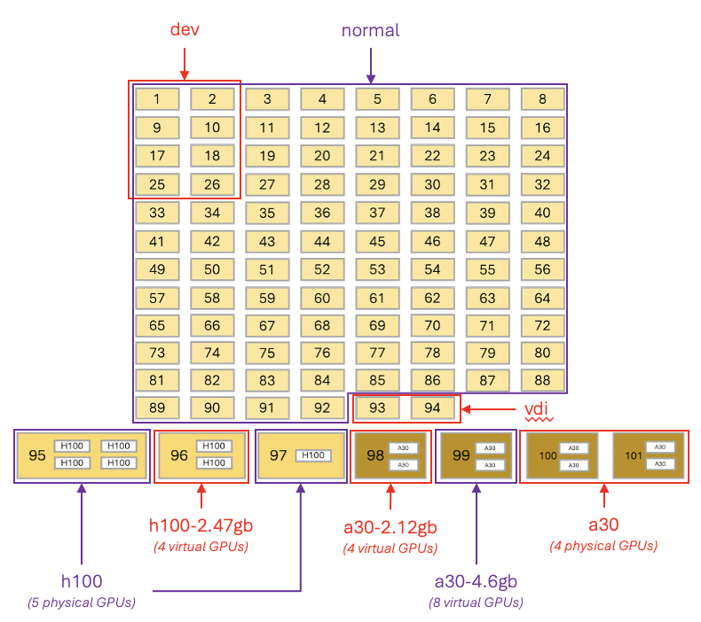

# SLURM Job Scheduler

## What is a Job Scheduler?

Juno has many nodes, and to manage them effectively and ensure jobs get the right resources, we use **Slurm** (Simple Linux Utility for Resource Management). Slurm handles job scheduling and resource allocation automatically.

## Why Use a Job Scheduler?

- **Resource management**: Ensures fair access to compute nodes
- **Job prioritization**: Runs jobs based on fair-share and other factors
- **Efficiency**: Maximizes cluster utilization
- **Isolation**: Your jobs run independently without interference

**Important:** All computational work must go through SLURM. Never run intensive computations directly on login nodes.

## SLURM Scheduling Priorities

The scheduler computes a priority for each queued job and selects the highest-priority job to run next. The formula is:

```
Job priority = 100,000 × (Fair share) + 1,000 × (Job age factor) + 1,000 × (Job size factor)
```

| Factor | Weight | Description |
|--------|--------|-------------|
| **Fair share** | 100,000 | How much of the cluster you have used recently |
| **Job age** | 1,000 | How long your job has been waiting in the queue |
| **Job size** | 1,000 | Larger jobs get a slight boost (HPC is designed for large workloads) |

Fair share dominates: users who have used the cluster recently get lower priority, which allows occasional users to run sooner.

## Understanding Fair Share

Fair share is a system that remembers who has been running jobs recently:

- **Initial state**: Everyone starts with a fair share of 1.0
- **After usage**: Your fair share drops (e.g., to 0.6)
- **Recovery**: Fair share gradually returns to 1.0 over **two weeks** of non-use

### Fair Share Example

| Time | User A | User B | Next Job |
|------|--------|--------|----------|
| Initially | 1.0 | 1.0 | - |
| A runs job | 0.6 | 1.0 | B (higher share) |
| B runs job | 0.6 | 0.5 | A (higher share) |
| 1 week later | 0.8 | 0.7 | A (higher share) |
| 2 weeks later | 1.0 | 1.0 | Equal priority |

**Key Points**:

- User with higher fair share gets priority
- Heavy users temporarily get lower priority
- Ensures occasional users aren't stuck behind constant users
- Complete recovery takes two weeks
- Fair Share value is reset at the beginning of the month

```
  Fair Share  (higher value = higher scheduling priority)

              User A   User B   Who runs next?
  ──────────────────────────────────────────────────────
  Initially   ████████ ████████  1.0 vs 1.0  —  equal
  After A     ████▌    ████████  0.6 vs 1.0  —  B wins
  After B     ████▌    ████      0.6 vs 0.5  —  A wins
  +1 week     ██████   █████▌    0.8 vs 0.7  —  A wins
  +2 weeks    ████████ ████████  1.0 vs 1.0  —  equal
  ──────────────────────────────────────────────────────
              0────────────────1
  Both users recover to 1.0 after ~2 weeks of inactivity.
```

### Checking Your Fair Share

```bash
# View your own fair share
sshare

# View all users' fair share
sshare -a
```

Look for your username in the second column and check the last column for your fair share value.

```
                     sbatch job.sh
                           │
                           ▼
                 ┌─────────────────┐
                 │    PENDING      │  waiting for resources / priority
                 └────────┬────────┘
                          │  resources allocated
                          ▼
                 ┌─────────────────┐
                 │    RUNNING      │  executing on compute node(s)
                 └────────┬────────┘
                          │
            ┌─────────────┼─────────────┐
            ▼             ▼             ▼
     ┌───────────┐  ┌──────────┐  ┌──────────┐
     │ COMPLETED │  │  FAILED  │  │ TIMEOUT  │
     │  exit 0   │  │ exit ≠ 0 │  │ walltime │
     └───────────┘  └──────────┘  │ exceeded │
                                   └──────────┘
```

## Ways to Run Jobs

### 1. Interactive on Login Node

!!! danger "Not Recommended for Computation"
    Use login nodes only for light tasks: editing, compiling, file management

```bash
# You're already on login node after SSH
[netID@juno-l-01 ~]$ 
```

### 2. Interactive on Compute Nodes

**Two-step process**:

```bash
# Step 1: Request resources
salloc -p normal -N 1 -n 1 -c 4 --mem=20GB

# Step 2: Start interactive session
srun --pty bash
```

Example session:

```
[dal281726@juno-l-02 ~]$ salloc -p normal -N 1 -n 1 -c 4 --mem=20GB
salloc: Granted job allocation 195702
Disk quotas for user dal281726, inode (file) count and disk usage:
=========================  ====================  ================  ============
Disk                       Usage                 Soft Limit        Hard Limit
=========================  ====================  ================  ============
/home/dal281726            70k|48GB              300k|50GB         320k|55GB
/work/dal281726            107k|641GB            3.0M|1.0TB        3.1M|1.1TB
=========================  ====================  ================  ============
[dal281726@juno-l-02 ~]$ srun --pty bash
Disk quotas for user dal281726, inode (file) count and disk usage:
=========================  ====================  ================  ============
Disk                       Usage                 Soft Limit        Hard Limit
=========================  ====================  ================  ============
/home/dal281726            70k|48GB              300k|50GB         320k|55GB
/work/dal281726            107k|641GB            3.0M|1.0TB        3.1M|1.1TB
=========================  ====================  ================  ============
[dal281726@c-03-15 ~]$ squeue --me
           JOBID    PARTITION               NAME      USER ST       TIME  NODES PRIORITY NODELIST(REASON)
          195511       normal sys/dashboard/sys/ dal281726  R      54:43      1    98906 c-03-13
          195702       normal        interactive dal281726  R       0:20      1    98831 c-03-15
[dal281726@c-03-15 ~]$
```

Notice the prompt changed from `juno-l-02` (login node) to `c-03-15` (compute node) after `srun --pty bash`. The quota summary prints automatically on each node login. Use `squeue --me` to confirm your job is running and see which node you landed on.

**Common options for salloc**:

- `-p` or `--partition`: Specify partition (normal, h100, a30, etc.)
- `--mem`: Memory allocation (e.g., `2GB`, `16GB`). **Default is 64 GB** if omitted — always set this explicitly, or your job may be memory-bound without warning.
- `-c` or `--cpus-per-task`: Number of CPUs
- `-t` or `--time`: Time limit (e.g., `1:00:00` for 1 hour)
- `-N` or `--nodes`: Number of nodes

**Example with more options**:
```bash
salloc -p normal --mem=8GB -c 4 -t 2:00:00
srun --pty bash
```

### 3. Batch Processing (Recommended)

Submit jobs using `sbatch` with a job script. The job runs on compute nodes without interactive involvement.

## Creating a Batch Job Script

### Basic Job Script Template

Create a file named `job.sh`:

```bash
#!/bin/bash
#SBATCH -J myjob              # Job name
#SBATCH -o output_%j.txt      # Output file (%j = job ID)
#SBATCH -e error_%j.txt       # Error file
#SBATCH -p normal             # Partition
#SBATCH -N 1                  # Number of nodes
#SBATCH -n 1                  # Number of tasks
#SBATCH -c 1                  # CPUs per task
#SBATCH --mem=2GB             # Memory (default is 64 GB if omitted)
#SBATCH -t 1:00:00            # Time limit (hh:mm:ss)

# Your commands here
echo "Job started on $(hostname) at $(date)"
echo "Running my program..."

# Load modules if needed
module load python/3.12.2

# Run your program
python my_script.py

echo "Job finished at $(date)"
```

### SBATCH Directives Explained

| Directive | Description | Example |
|-----------|-------------|---------|
| `-J` or `--job-name` | Job name | `#SBATCH -J my_analysis` |
| `-o` or `--output` | Standard output file | `#SBATCH -o output_%j.log` |
| `-e` or `--error` | Standard error file | `#SBATCH -e error_%j.log` |
| `-p` or `--partition` | Queue/partition | `#SBATCH -p normal` |
| `-N` or `--nodes` | Number of nodes | `#SBATCH -N 2` |
| `-n` or `--ntasks` | Number of tasks | `#SBATCH -n 4` |
| `-c` or `--cpus-per-task` | CPUs per task | `#SBATCH -c 8` |
| `--mem` | Memory per node | `#SBATCH --mem=16GB` |
| `--mem-per-cpu` | Memory per CPU | `#SBATCH --mem-per-cpu=4GB` |
| `-t` or `--time` | Time limit | `#SBATCH -t 24:00:00` |
| `--mail-type` | Email notifications | `#SBATCH --mail-type=END,FAIL` |
| `--mail-user` | Email address | `#SBATCH --mail-user=user@utdallas.edu` |

### Submitting a Job

```bash
sbatch job.sh
```

You'll receive a job ID:
```
Submitted batch job 12345
```

### Example Job Scripts

#### Python Job

```bash
#!/bin/bash
#SBATCH -J python_analysis
#SBATCH -o python_%j.out
#SBATCH -e python_%j.err
#SBATCH -p normal
#SBATCH -c 4
#SBATCH --mem=8GB
#SBATCH -t 2:00:00

module load miniconda

conda activate /path/to/env

python analyze_data.py --input data.csv --output results.txt
```

#### MATLAB Job

```bash
#!/bin/bash
#SBATCH -J matlab_sim
#SBATCH -o matlab_%j.out
#SBATCH -e matlab_%j.err
#SBATCH -p normal
#SBATCH -c 8
#SBATCH --mem=16GB
#SBATCH -t 12:00:00

module load matlab/r2024b

matlab -nodisplay -nosplash -r "run('simulation.m'); exit;"
```

#### GPU Job

```bash
#!/bin/bash
#SBATCH -J gpu_training
#SBATCH -o gpu_%j.out
#SBATCH -e gpu_%j.err
#SBATCH -p a30
#SBATCH --gres=gpu:1
#SBATCH -c 4
#SBATCH --mem=32GB
#SBATCH -t 24:00:00

module load cuda/12.4

conda activate /path/to/env

python train_model.py
```

#### Array Job (Multiple Similar Jobs)

```bash
#!/bin/bash
#SBATCH -J array_job
#SBATCH -o array_%A_%a.out
#SBATCH -e array_%A_%a.err
#SBATCH -p normal
#SBATCH --array=1-10
#SBATCH -c 2
#SBATCH --mem=4GB
#SBATCH -t 1:00:00

# Process file based on array index
echo "Processing file_${SLURM_ARRAY_TASK_ID}.dat"
python process.py file_${SLURM_ARRAY_TASK_ID}.dat
```

## Monitoring Jobs

### Check Job Queue

```bash
# View all your jobs
squeue --me

# View specific job
squeue -j 12345

# View all jobs in a partition
squeue -p normal
```

```
             JOBID    PARTITION               NAME      USER ST       TIME  NODES PRIORITY NODELIST(REASON)
            195511       normal sys/dashboard/sys/ dal281726  R       3:47      1    98906 c-03-13
```

**Output columns**:

- `JOBID`: Job identifier
- `PARTITION`: Queue name
- `NAME`: Job name
- `USER`: Username
- `ST`: State (PD=pending, R=running, CG=completing)
- `TIME`: Time running
- `NODES`: Number of nodes
- `NODELIST(REASON)`: Nodes allocated or reason for waiting

### Check Job Status

```bash
# Detailed job information
scontrol show job 12345

# Job accounting information
sacct -j 12345
```

### Check Job History

```bash
# View completed jobs
sacct -u $USER

# View jobs from specific date
sacct -u $USER --starttime 2024-01-01

# Detailed format
sacct -j 12345 --format=JobID,JobName,State,Start,End,Elapsed,MaxRSS
```

## Managing Jobs

### Cancel a Job

```bash
# Cancel specific job
scancel 12345

# Cancel all your jobs
scancel -u $USER

# Cancel all jobs in a partition
scancel -u $USER -p normal

# Cancel array job tasks
scancel 12345_[1-5]
```

### Hold/Release Jobs

```bash
# Put job on hold
scontrol hold 12345

# Release held job
scontrol release 12345
```

## Job Dependencies

Run jobs in sequence:

```bash
# Submit first job
job1=$(sbatch --parsable job1.sh)

# Submit second job that depends on first
sbatch --dependency=afterok:$job1 job2.sh
```

**Dependency types**:

- `afterok`: Start after successful completion
- `afternotok`: Start only if previous failed
- `afterany`: Start after completion (success or failure)
- `after`: Start after job begins

## Troubleshooting

### Job Pending for Long Time

**Check reason**:
```bash
squeue -u $USER -l
```

**Common reasons**:

- `Resources`: No available resources
- `Priority`: Other jobs have higher priority
- `QOSMaxCpuPerUserLimit`: Exceeded CPU limit
- `AssocGrpMemLimit`: Exceeded memory limit

**Solutions**:

- Reduce resource requests
- Wait for fair share to recover
- Check if requesting too much memory/CPUs

### Job Failed Immediately

**Check error file**:
```bash
cat error_12345.txt
```

**Common issues**:

- Module not loaded
- Incorrect paths
- Permission errors
- Missing input files

### Out of Memory Error

**Symptoms**:

- Job killed with exit code 137
- "Out of memory" in error file

**Solutions**:
```bash
# Increase memory request
#SBATCH --mem=32GB

# Or per CPU
#SBATCH --mem-per-cpu=8GB
```

### Job Times Out

**Increase time limit**:
```bash
#SBATCH -t 48:00:00  # 48 hours
```

Check partition limits with:
```bash
sinfo -o "%P %l"
```

## Best Practices

1. **Estimate resources accurately**:
   - Don't over-request (wastes resources)
   - Don't under-request (job fails)
   - Run test jobs to determine needs

2. **Use appropriate partitions**:
   - `normal` for CPU jobs, `dev` for short test jobs
   - `h100` / `a30` (and their virtual-slice variants) for GPU jobs
   - See the [partitions table](#partitions-overview) or run `sinfo`

3. **Organize output files**:
   ```bash
   #SBATCH -o logs/output_%j.txt
   #SBATCH -e logs/error_%j.txt
   ```

4. **Test with small jobs first**:
   ```bash
   #SBATCH -t 0:10:00  # 10 minutes for testing
   ```

5. **Monitor resource usage**: Run `jobstats <jobid>` after a job completes to see CPU and memory efficiency. See [Monitoring Jobs and Cluster State](advanced-slurm.md).

6. **Clean up old files**:
   - Remove old output/error files
   - Archive completed results

## Partitions Overview



| Partition name | Time limit | Nodes | Max nodes/job | Cores/node | Memory/node | GPUs/node                 | VRAM/GPU | Best used for |
|----------------|------------|-------|----------------|------------|-------------|---------------------------|----------|---------------|
| `dev`            | 2 hours    | 8*    | 1              | 64         | 384 GB      | –                         | –        | Code development, short jobs, benchmarking |
| `normal`         | 2 days     | 92*   | 8†             | 64         | 384 GB      | –                         | –        | Long jobs, big jobs, production (main) compute workloads |
| `h100`           | 2 days     | 1     | 1              | 64         | 512 GB      | 4 H100 (physical)         | 80 GB    | Large, long jobs requiring high GPU resources |
| `h100-94gb`      | 2 days     | 1     | 1              | 64         | 512 GB      | 1 H100 (physical, NVL)    | 94 GB    | Jobs requiring a single high-memory H100 |
| `h100-2.47gb`    | 2 days     | 1     | 1              | 64         | 512 GB      | 4 half-H100 (virtual)     | 47 GB    | GPU workloads with moderate memory needs |
| `a30`            | 2 days     | 2     | 2              | 128        | 1,024 GB    | 2 A30 (physical)          | 24 GB    | Large, long jobs requiring medium GPU resources |
| `a30-2.12gb`     | 2 days     | 1     | 1              | 128        | 1,024 GB    | 4 half-A30 (virtual)      | 12 GB    | GPU jobs with moderate memory needs |
| `a30-4.6gb`      | 2 days     | 1     | 1              | 128        | 1,024 GB    | 8 quarter-A30 (virtual)   | 6 GB     | GPU jobs with minimal memory requirements |
| `vdi`            | 8 hours    | 2     | 1              | 64         | 384 GB      | –                         | –        | GUI-interactive workloads |

\* `dev` partition shares nodes with the `normal` partition.

† Up to 8 nodes/job. Contact [circ-assist@utdallas.edu](mailto:circ-assist@utdallas.edu) to request more nodes for jobs that demonstrate efficient parallel scaling.

**Per-user limits**: max 4 running jobs, max 8 submitted jobs at a time. These limits can be relaxed for specific projects — contact support with evidence of efficient scaling.


## Advanced Topics

### Job Scripts with Arguments

```bash
#!/bin/bash
#SBATCH -J parametric_job

INPUT=$1
OUTPUT=$2

python process.py --input $INPUT --output $OUTPUT
```

Submit with:
```bash
sbatch job.sh data.csv results.txt
```

### Environment Variables

Useful SLURM environment variables:

- `$SLURM_JOB_ID`: Job ID
- `$SLURM_ARRAY_TASK_ID`: Array task ID
- `$SLURM_CPUS_PER_TASK`: CPUs allocated
- `$SLURM_MEM_PER_NODE`: Memory allocated
- `$SLURM_SUBMIT_DIR`: Directory where job was submitted
- `$SLURM_NODELIST`: List of allocated nodes

## Next Steps

- [Run common scientific programs (MATLAB, Gaussian, Fluent, Python) →](common-programs.md)
- [Learn about parallelism models →](parallelism.md)
- [High throughput with Launcher →](launcher.md)
- [Optimize Python code →](../advanced/python-optimization.md)

## Need Help?

- **Email**: [circ-assist@utdallas.edu](mailto:circ-assist@utdallas.edu)
- **HPC Services**: [hpc.utdallas.edu/services](https://hpc.utdallas.edu/services)